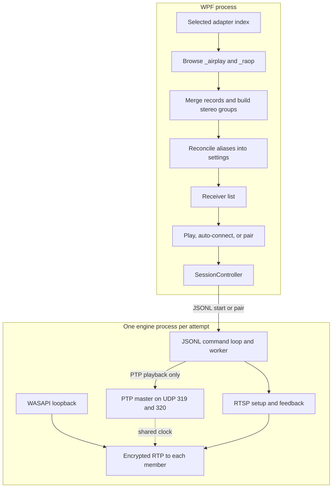

# AirFlash receiver workflow

This set describes the path from a HomePod advertisement to a live AirPlay 2 stream in the runtime source at `41190e0d13a63a714c08dffe73ababca1804875c`. The documentation baseline is `c077a0577de26ad7e44b8fd50f62456e12965fb0`, which adds `docs/analysis/` and `docs/issues/` without changing runtime source. These are pinned snapshots, not a promise about a moving remote branch.

Source links in the original audit are pinned to that runtime commit, including its line anchors. Later implementation sections identify their own feature commit and verification separately; merging changes into the fork does not change the historical source evidence.

Every original page was audited against source on **2026-10-06**. [Audit results](audit.md) records coverage, material corrections, invariant checks, tests, and limitations. Source inspection establishes implemented behavior; it does not establish actual HomePod compatibility, measured acoustic latency, or a cause for a particular disconnect. `docs/issues/` contains hypotheses and proposed changes, not independent proof. [Upstream dev](upstream-dev.md) is an explicitly excluded development snapshot.

Read the table from top to bottom. The later pages describe mechanisms that cut across those stages, followed by a check of earlier investigation claims against this tree.

Group B's session/receiver changes were subsequently implemented and verified on `codex/fix-session-lifecycle` at `342aeb7`, based directly on original stable `41190e0`. Group A and then Group B are now merged into local fork `main` at `72dc7c7`; original upstream `main` remains unchanged. [Feature acceptance and actual checks](../issues/GROUP-B-ACCEPTANCE.md) distinguish tested feature behavior from this index's original stable-source audit. Affected pages retain their baseline descriptions and add an implementation section; [combined fork validation](../issues/FORK-INTEGRATION-ACCEPTANCE.md) records later hosted-build and downloaded-binary evidence separately.

| Document | What it covers |
| --- | --- |
| [Discovery](discovery.md) | Windows DNS-SD browse and resolve, the record cache, and adapter filtering |
| [After discovery](after-discovery.md) | How advertisements become rows, reconcile active sessions, and gate play, pairing, and auto-connect |
| [Identity](identity.md) | The canonical-id walk, alias map, and preference merge |
| [Settings](settings.md) | `config.json`, schema migration, Apply, and the desktop shell |
| [Session](session.md) | The desktop state machine that opens, watches, and replaces an engine process |
| [Engine](engine.md) | RTSP setup, PTP, WASAPI capture, RTP, and the watches that keep one session alive |
| [Equalizer](equalizer.md) | The ten-band filter, automatic headroom, and live preview |
| [Authentication](auth.md) | Transient setup, persistent pairing, and pair-verify |
| [Failures](failures.md) | Every path that ends or replaces a session, and what the panel shows |
| [Playback coupling](playback-coupling.md) | Why a discovery snapshot can stop a live stream, hide the row, restore local mute, and leave the reconnect counter at zero |
| [Capture and clocks](capture-clocks.md) | The loopback queue, what an underrun packet counts, and the three clocks the sender actually uses |
| [Control and mute](control-and-mute.md) | Local mute restore, the shared RTSP lock, and how PTP sockets are bound |
| [Credentials and IPC](credentials-and-ipc.md) | The JSONL process boundary and the DPAPI pairing files |
| [Source check](source-check.md) | Which earlier investigation claims match this tree, and which do not |
| [Upstream dev](upstream-dev.md) | Verified differences in excluded commit `67435a4`; no behavior imported into the baseline |
| [Audit results](audit.md) | Source baseline, all-page coverage, corrected briefing claims, and validation limits |

## Two processes

The WPF app finds devices and decides whether a session should exist. The Rust engine, `airflash-engine.exe`, speaks AirPlay. The discovery service browses DNS-SD; it does not open RTSP or audio connections. Discovery results can nevertheless cause the desktop session controller to stop or restart playback. The engine never browses DNS-SD. The boundary is JSONL v1 over redirected stdin/stdout, with no C-ABI or shared memory; [Credentials and IPC](credentials-and-ipc.md) explains the limits in each direction.

Startup order in [`App.OnStartup`](https://github.com/Ding-Kyoma/AirFlash/blob/41190e0d13a63a714c08dffe73ababca1804875c/desktop/AirFlash.App/App.xaml.cs):

1. Load `config.json`, apply theme and language, and construct `AudioService`.
2. Extract the engine to `%LOCALAPPDATA%\AirFlash\engine\<sha256>\airflash-engine.exe` and construct the process factory, then construct `WindowsDiscovery` and the view model without starting discovery. Run `hello` in a separate process. The reply includes `engine_version`, `qualification: partial`, and `production_ready: false`; the desktop disposes that check process after the reply. It does not use the receiver list. The rest of the shell, including the single-instance pipe and the check flags, is in [Settings](settings.md).
3. Construct the panel and tray, start the single-instance listener, then call the view model's `Start`, which launches asynchronous initialization. `StartAsync` obtains the default endpoint, applies autostart, awaits capture-endpoint migration, then calls `discovery.Start`, draws manual rows, and arms auto-connect. The app shows the panel after calling `Start` unless `--startup` was passed; it does not wait for that initialization to finish.
4. The first discovery publish is the empty cache from `Restart`. Resolved speakers arrive after that.

A second instance only signals the running one and exits. `--discovery-check` browses for eight seconds and does not open the engine.

## Five stages

1. **Browse.** `WindowsDiscovery` keeps long-lived browses for `_airplay._tcp.local` and `_raop._tcp.local` on the selected IPv4 interface. Each instance is resolved to one IPv4 address, a port, and TXT records. See [Discovery](discovery.md).

2. **Name the device.** `ReceiverAggregator` merges the AirPlay and RAOP advertisements for one speaker, then folds speakers that share a `tsid` into one `stereo:{tsid}` row. `ReceiverCatalog` rewrites ids so saved settings follow the speaker across address changes. See [After discovery](after-discovery.md).

3. **Decide.** The UI shows online, visible rows. Settings may also show hidden and offline history. The HomePod has only answered mDNS. A connection starts when the user presses play or Pair, or when the 900 ms auto-connect timer fires. Auto-connect is off unless a setting turns it on. See [After discovery](after-discovery.md).

4. **Open a process.** `SessionController` resolves each member to IPv4, leader first. Play opens one process and sends `start`, followed by the current equalizer update; other controls use the same pipe later. Pairing opens one process per member for `pair`, then a playback process for `start`. See [Session](session.md).

5. **Hold the session.** The engine authenticates, completes SETUP, then sends the same PCM to every member under one PTP clock. Feedback, the event channel, and the media watchdog can end its playback worker; the desktop then disposes the process. A replacement session is a new process and a new handshake. See [Engine](engine.md).

## What crosses the process boundary

The `start` command carries each member's IPv4 address, port, and RAOP codec list (`cn`), plus capture endpoint, latency, sample rate, master gain, equalizer settings, `source: loopback`, `timing: ptp`, and `duration_ms: 0`. Master gain is `MasterVolume / 100`, or 0 while the panel mute is on. The saved per-receiver volume is not that gain. It does not carry the discovery id, the stereo id, the display name, or a group UUID. Native options also accept `group_id`, `timing: ntp`, `handshake_only`, and `record_mic_path`; the desktop playback path sends none of those overrides. `scripts/e2e_stream.py` drives a finite probe and defaults its latency argument to 150 ms. That default is not one of the four desktop latency modes. Probe safety is enforced separately from unbounded playback; see [Audit results](audit.md).

Credentials live in the engine, under `%APPDATA%\AirFlash\native-credentials\`, keyed by the `deviceID` from `GET /info`. The desktop catalog id and that credential id are separate. An alias migration in `config.json` does not move a pairing file.

## Defaults that shape the workflow

| Setting | Default | Effect |
| --- | --- | --- |
| Discovery interface | All interfaces | A chosen NIC pauses discovery when that NIC is down |
| Auto-connect | Off | A new row waits for play |
| Force reconnect | Off | The first engine failure stays on the error screen |
| Reconnect attempts | 5 | Used only when force reconnect is on. Allowed range is 1–20 |
| Mute while streaming | On | The local endpoint is muted after the engine reports `streaming` |
| Latency | `normal` (200 ms) | Realtime is 120 ms, buffered is 500 ms, custom is 0–2000 ms |
| Sample rate | 44100 | The other accepted rate is 48000 |
| Standby | Off | When on, the label changes after 10 seconds of local silence. The stream continues |

## Scope of one session

The desktop accepts one receiver row or a complete two-member stereo row. Native `start`/`probe` validation accepts one or two distinct IPv4 peers; it does not independently prove that they are an existing stereo pair. Persistent pairing has a separate parser. Both playback peers share a capture queue, an RTP timestamp origin, and a PTP clock. Each has its own RTSP connection, event channel, feedback loop, RTP sequence, SSRC, and keys. A detected fatal fault in either member ends the playback worker for both; a missing advertisement alone is handled by the desktop, and a successful UDP send does not prove the receiver is alive. The command process remains available until stdin closes or another command changes its owned work. The desktop disposes that process and opens a fresh one for each retry.
