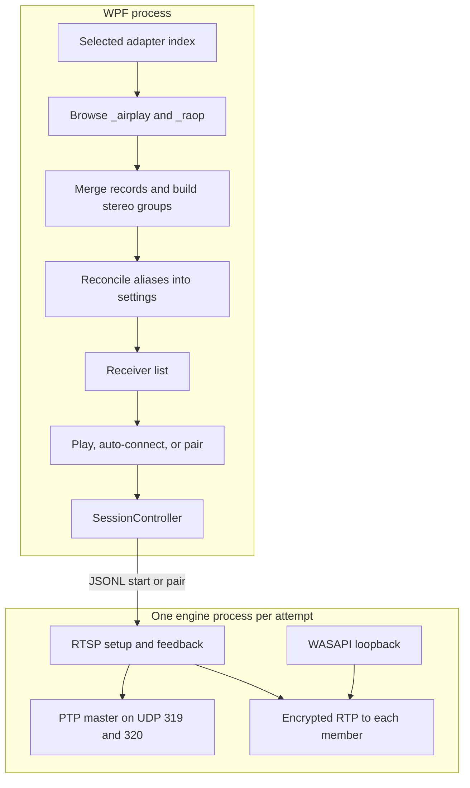

# AirFlash receiver workflow

This set describes the current path from a HomePod advertisement to a live AirPlay 2 stream on this checkout. It records how the code behaves today. Read the table from top to bottom. The later pages are the mechanisms that cut across those stages, then a check of earlier investigation claims against this tree. [Upstream dev](upstream-dev.md) is a later pre-release and is not the tree these pages describe.

| Document | What it covers |
| --- | --- |
| [Discovery](discovery.md) | Windows DNS-SD browse and resolve, the record cache, and adapter filtering |
| [After discovery](after-discovery.md) | How advertisements become rows, and every action that runs before a HomePod socket opens |
| [Identity](identity.md) | The canonical-id walk, alias map, and preference merge |
| [Settings](settings.md) | `config.json`, schema migration, Apply, and the desktop shell |
| [Session](session.md) | The desktop state machine that opens, watches, and replaces an engine process |
| [Engine](engine.md) | RTSP setup, PTP, WASAPI capture, RTP, and the watches that keep one session alive |
| [Equalizer](equalizer.md) | The ten-band filter, automatic headroom, and live preview |
| [Authentication](auth.md) | Transient setup, persistent pairing, and pair-verify |
| [Failures](failures.md) | Every path that ends or replaces a session, and what the panel shows |
| [Playback coupling](playback-coupling.md) | Why a discovery snapshot can stop a live stream, hide the row, restore local mute, and leave the reconnect counter at zero |
| [Capture and clocks](capture-clocks.md) | The loopback queue, what an underrun packet counts, and the three clocks the sender actually uses |
| [Control and mute](control-and-mute.md) | Local mute restore, the shared RTSP lock, and how PTP sockets are bound |
| [Credentials and IPC](credentials-and-ipc.md) | The JSONL process boundary and the DPAPI pairing files |
| [Source check](source-check.md) | Which earlier investigation claims match this tree, and which do not |
| [Upstream dev](upstream-dev.md) | What v0.3.3-rc.1 changes, and what these notes still describe |

## Two processes

The WPF app finds devices and decides whether a session should exist. The Rust engine, `airflash-engine.exe`, speaks AirPlay. Discovery never opens a socket to a speaker. The engine never browses DNS-SD.

Startup order in [`App.OnStartup`](../../desktop/AirFlash.App/App.xaml.cs):

1. Load `config.json`, apply theme and language, and construct `AudioService` and `WindowsDiscovery`. Discovery is not started yet.
2. Extract the engine to `%LOCALAPPDATA%\AirFlash\engine\<sha256>\airflash-engine.exe` and run `hello`. The reply includes `engine_version`, `qualification: partial`, and `production_ready: false`. That process exits. It does not use the receiver list. The rest of the shell, including the single-instance pipe and the check flags, is in [Settings](settings.md).
3. Show the panel unless `--startup` was passed. `Start` then applies autostart, migrates a capture endpoint that was saved by friendly name, calls `discovery.Start`, draws manual rows, and arms auto-connect.
4. The first discovery publish is the empty cache from `Restart`. Resolved speakers arrive after that.

A second instance only signals the running one and exits. `--discovery-check` browses for eight seconds and does not open the engine.

## Five stages

1. **Browse.** `WindowsDiscovery` keeps long-lived browses for `_airplay._tcp.local` and `_raop._tcp.local` on the selected IPv4 interface. Each instance is resolved to one IPv4 address, a port, and TXT records. See [Discovery](discovery.md).

2. **Name the device.** `ReceiverAggregator` merges the AirPlay and RAOP advertisements for one speaker, then folds speakers that share a `tsid` into one `stereo:{tsid}` row. `ReceiverCatalog` rewrites ids so saved settings follow the speaker across address changes. See [After discovery](after-discovery.md).

3. **Decide.** The UI shows online, visible rows. Settings may also show hidden and offline history. The HomePod has only answered mDNS. A connection starts when the user presses play or Pair, or when the 900 ms auto-connect timer fires. Auto-connect is off unless a setting turns it on. See [After discovery](after-discovery.md).

4. **Open a process.** `SessionController` resolves each member to IPv4, leader first, and sends one JSONL command. Play sends `start`. Pairing sends `pair` once per member, then `start`. See [Session](session.md).

5. **Hold the session.** The engine authenticates, completes SETUP, then sends the same PCM to every member under one PTP clock. Feedback, the event channel, and the media watchdog decide when that process must end. A replacement session is a new process and a new handshake. See [Engine](engine.md).

## What crosses the process boundary

The `start` command carries each member's IPv4 address, port, and RAOP codec list (`cn`), plus capture endpoint, latency, sample rate, master gain, equalizer settings, `source: loopback`, `timing: ptp`, and `duration_ms: 0`. Master gain is `MasterVolume / 100`, or 0 while the panel mute is on. The saved per-receiver volume is not that gain. It does not carry the discovery id, the stereo id, the display name, or a group UUID. The engine can accept `group_id`, `timing: ntp`, `handshake_only`, and `record_mic_path` on a probe. The desktop start path sends none of those. `scripts/e2e_stream.py` drives that probe and defaults its latency argument to 150 ms. That default is not one of the four desktop latency modes.

Credentials live in the engine, under `%APPDATA%\AirFlash\native-credentials\`, keyed by the `deviceID` from `GET /info`. The desktop catalog id and that credential id are separate. An alias migration in `config.json` does not move a pairing file.

## Defaults that shape the workflow

| Setting | Default | Effect |
| --- | --- | --- |
| Discovery interface | All interfaces | A chosen NIC pauses discovery when that NIC is down |
| Auto-connect | Off | A new row waits for play |
| Force reconnect | Off | The first engine failure stays on the error screen |
| Reconnect attempts | 5 | Used only when force reconnect is on. Allowed range is 1–20 |
| Mute while streaming | On | The local endpoint is muted after the engine reports `streaming` |
| Latency | `normal` (200 ms) | Realtime is 120 ms, buffered is 500 ms, custom is 0–2000 ms |
| Sample rate | 44100 | The other accepted rate is 48000 |
| Standby | Off | When on, the label changes after 10 seconds of local silence. The stream continues |

## Scope of one session

The engine accepts one speaker or one existing two-device pair, IPv4 only, on Windows. Both members of a pair share a capture queue, an RTP origin, and a PTP clock. Each member has its own RTSP connection, event channel, feedback loop, SSRC, and keys. Losing either member ends the process for both.
