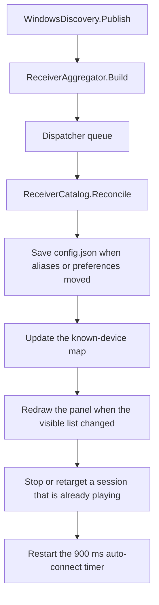

# After discovery, before a connection

A discovery callback ends as a list of service records. Everything in this document runs on the WPF UI thread, under the settings lock, and finishes before any HomePod socket exists. The engine process for playback is opened later, by play, by Pair, or by the auto-connect timer. Those doors are specified in [Session](session.md).

The pipeline is:

`Changed` is raised on a DNS or timer thread. The view model queues `OnDiscovered` with `Dispatcher.BeginInvoke`. Updates take `_settingsGate`, so a slow save finishes before the next result is applied.

## Merging advertisements

[`ReceiverAggregator.Build`](../../desktop/AirFlash.Core/Receiver.cs) runs on every publish, including a publish whose records did not change.

Services are ordered AirPlay first, then by instance name, address, and port. They collapse in one pass:

- Records with the same normalized identity join. `AA:BB:CC:DD:EE:01`, `AA-BB-CC-DD-EE-01`, and `aabbccddee01` are one id. A RAOP name such as `AABBCCDDEE01@Cinema._raop._tcp.local` uses `aabbccddee01` when `deviceid` is empty, and `Cinema` as the display name.
- Records that share `address:port` can also join. They join only when exactly one existing group is compatible. Compatible means `model`, `tsid`, and `pk` do not disagree. An empty field agrees with any value. `pk` is case-sensitive, so `AbCd==` and `abcd==` stay apart.
- Two compatible groups, or any incompatible group at that endpoint, are logged as `Discovery identity conflict` and left unmerged. The line names the disagreeing fields (`model`, `tsid`, `pk`) and sets `ambiguous_endpoint` when more than one compatible group was found.
- Links are transitive. An AirPlay record and a RAOP record can meet through a third record that shares an identity with one and an endpoint with the other.

Each physical group becomes one `Receiver`. The id is the normalized device id, or `host:port` when no id exists. Two unidentified services that would share that endpoint id receive distinct ids, `endpoint:{host:port}#{16 hex chars}` of the service type and instance. The display name and address come from the first record after AirPlay-first ordering. Codecs are the comma-separated `cn` bytes from the RAOP record only. `tsid`, `gpn`, and `igl` are copied onto the device.

A merge of more than one service is logged as `Discovery merged:` with the reason `normalized_identity` or `compatible_endpoint`. Diagnostic lines are logged once per distinct message until the set of messages changes.

### Stereo rows

Devices with an empty `tsid` stay as their own rows. Devices that share a `tsid` become one row:

| Property | Value |
| --- | --- |
| Id | `stereo:{tsid}` |
| Name | `gpn` when it is non-empty, otherwise the leader's name |
| Member order | Leader (`igl=1`) first, then member id |
| Complete | Exactly two members |
| Detail | `HomePod stereo · {n}/2` |

A single visible member is still a stereo row. It is `1/2` and its play command stays disabled. Switching which member has `igl=1` changes the row address and leaves the id on `stereo:{tsid}`. The group row's `Aliases` array is empty. Member aliases stay on the members. The individual members are not shown beside the pair in the main window. `ReceiverCatalog.IsCoveredMember` removes a member id from the known map while an online pair already contains it. `ToggleAsync` still rewrites a clicked row onto that stereo group when any member has the same address, and then starts the group.

Member preferences stay on the member ids. Hiding one member does not hide the `stereo:` row. The pair has its own saved options.

## Stable identity

[`ReceiverCatalog.Reconcile`](../../desktop/AirFlash.Core/ReceiverCatalog.cs) rewrites each discovered device onto one canonical id before the panel updates. The walk, the alias rules, and the preference merge are in [Identity](identity.md). The outcome that this stage depends on is:

- A MAC-shaped id, a RAOP prefix, and a saved `host:port` that belongs to exactly one live device become one id.
- Manual ids are not rewritten and are not alias targets.
- Hidden is OR-merged. An explicit auto-connect `false` wins. Volume, latency, custom buffer, and standby come from the highest-priority old record.
- `LastReceiverId` follows the migration. Endpoint aliases are not a durable identity. `Load` drops any alias whose key or value is not a broadcast id. See [Settings](settings.md).

If the resulting settings differ from memory, the view model writes `%APPDATA%\AirFlash\config.json`. The first such save also copies the previous file to `config.json.pre-receiver-identity.bak` once. A failed save leaves the in-memory catalog and any current playback unchanged. The log line is `Receiver identity migrated:`.

Open Settings drafts keep unsaved edits. The new alias map is copied into the draft and the baseline, so a later Apply does not recreate the old id. An equal alias list does not redraw the panel and does not open the engine.

When a previous row's id changes and the new id is in this result, the view model logs `Receiver identity upgraded:`. The reason is `confirmed_broadcast_alias` for a device id, or `unique_endpoint` for a `host:port` id that uniquely matched.

## The known-device map

After reconciliation the view model updates `_known`:

- Each discovered id replaces the previous entry.
- An id that migrated away, and a member covered by an online pair, is removed.
- Auto-connect attempt marks follow an id when it migrates.
- A device missing from this result stays in the map with `Online = false` when discovery is set to all interfaces. With a specific adapter selected, it is removed.
- A device that was offline or incomplete, and is now online and complete, has its auto-connect attempt cleared. A later timer run may start it.
- Manual receivers from settings are written back over the map. They are always online. Discovery cannot add or delete them.

`RefreshReceivers` then builds the main panel from rows that are online and not hidden, ordered by name. The same id updates the existing row in place. A new id is inserted. A vanished id is removed. `CatalogChanged` fires only when that visible catalog differs, and the Settings receiver page rebuilds from it.

The panel's empty card says "Searching for receivers" whenever the filtered list is empty. That covers a browse still in progress, a paused adapter, every device hidden, and every device offline. The paused-adapter sentence appears in Settings → Network and, through `Failed`, in the panel notice. The notice does not itself remove rows. The empty publish does.

An offline flag hides the row from the control panel in both adapter modes, because `RefreshReceivers` requires `Online`. The two modes differ in the map and in Settings:

| Discovery interface | Missing from this snapshot | Control panel | Settings list |
| --- | --- | --- | --- |
| All interfaces | `Online = false`. The entry stays in `_known` | Row removed | Offline history row, when the id is still in saved options and is not a covered stereo member |
| A selected NIC | `_known.Remove`. Saved options in `config.json` stay | Row removed | Row removed. The preference record remains in the file |

A manual receiver is never removed by this loop. The consequences for a stream that is already playing are in [Playback coupling](playback-coupling.md).

On a row, before any connection:

| Condition | State text | Play |
| --- | --- | --- |
| Online and complete | `Disconnected` | Enabled |
| Stereo with fewer than two members | `Waiting for the other member` | Disabled |
| Offline | Hidden from the panel. Settings shows `Offline` when all interfaces are selected | Disabled |

The device-volume slider stays disabled. Its reading arrives only after a stream reports `device_volume`. Pairing is a Settings command on that receiver. Discovery does not ask for a PIN.

The Settings list is wider than the panel. It includes hidden devices. When discovery uses all interfaces, it also keeps offline history rows for saved ids that are not covered stereo members. Additions, removals, and device options are written when the user applies Settings. Pairing starts immediately and does not wait for Apply.

## A session that is already playing

This step still does not open a HomePod socket. It only stops or retargets the desktop session object.

For a playing receiver that came from discovery:

- The playing id is translated through the migration map.
- If that id is absent, or the stereo row is no longer 2/2, an active session is stopped. A `1/2` row remains on screen.
- If the receiver or the settings object changed, `UpdateReceiverAsync` runs. The engine process is replaced only when the transport signature changes. That signature is `address:port:isLeader` for each member, plus the capture endpoint, latency, and sample rate. An identity promotion with the same address updates the session object and leaves the process running.
- A codec-only, name-only, or model-only change does not change the signature, so playback continues on the codec list captured at the last `start`.

A manual receiver that is playing is left alone by this step. Its session ends from the engine, from stop, or from a settings change that alters the same signature.

An empty publish, which every `Restart` emits, is a normal discovery result. On all interfaces the current speakers become offline and a discovered session stops. On a selected NIC they are removed and a discovered session stops. When the browse fills back in, the rows return. Playback starts again only through auto-connect or another press of play. That new start is a fresh session, so the reconnect counter stays at zero. The in-process reconnect loop described in [Session](session.md) is a different path.

## The auto-connect timer

Every discovery result, including an identical one, restarts a 900 ms timer. `TryAutoConnectAsync` starts a connection only when all of the following hold:

- The user has not pressed stop since the last play. Stop sets a suppress flag.
- No session is active. Active includes connecting, streaming, standby, and pairing.
- Global auto-connect is on, or this receiver's own override is on. Both default off. A per-receiver `false` overrides a global `true`.
- The receiver is online, complete, and not hidden.
- This id has not already been attempted since it last became newly complete.

If several receivers qualify, the last-used id wins. Otherwise the first name in the current list wins. One receiver is started, through the same `ToggleAsync` path as a click. A failed attempt counts. Repeating the same discovery result does not try again. A real offline-to-online cycle clears the attempt and allows another.

Turning global auto-connect from off to on clears the suppress flag and the attempt set, then schedules the timer.

Until that timer fires, or the user presses play or Pair, the speaker has only answered mDNS. No playback engine is opened for it.
