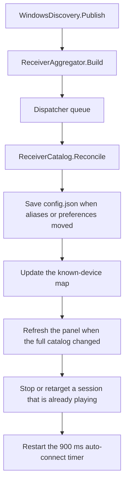

# After discovery: catalog, session updates, and auto-connect

A discovery publication aggregates cached service records into receiver rows on the caller's thread. The view model queues those rows on the WPF dispatcher; catalog reconciliation then takes the asynchronous settings gate. Before playback starts, this pipeline does not contact a receiver beyond DNS-SD. During an active session, reconciliation can stop playback or start a replacement engine. Normal app startup also opens a short-lived engine for `hello` before discovery starts. The playback and pairing entry points are specified in [Session](session.md).

The pipeline is:

`Changed` is raised on the thread calling `Publish`: a DNS callback, refresh timer, or a synchronous restart caller such as startup or Settings Apply. The view model queues `OnDiscovered` with `Dispatcher.BeginInvoke`. Reconciliations take `_settingsGate`, so a save finishes before the next queued result is applied. `await` yields the UI thread; the gate serializes transactions rather than blocking the dispatcher for network work.

## Merging advertisements

[`ReceiverAggregator.Build`](../../desktop/AirFlash.Core/Receiver.cs) runs on every publish, including a publish whose records did not change.

Services are ordered AirPlay first, then by instance name, address, and port. They collapse in one pass:

- Records with the same normalized identity join, even if their model, stereo id, or public key conflicts. The endpoint compatibility check is not an authentication check or a veto on identity matches. `AA:BB:CC:DD:EE:01`, `AA-BB-CC-DD-EE-01`, and `aabbccddee01` are synthetic examples of one id. A RAOP name such as `AABBCCDDEE01@Cinema._raop._tcp.local` uses `aabbccddee01` when `deviceid` is empty, and `Cinema` as the display name.
- Records that share `address:port` can also join. They join only when exactly one existing group is compatible. Compatible means `model`, `tsid`, and `pk` do not disagree. An empty field agrees with any value. `pk` is case-sensitive, so `AbCd==` and `abcd==` stay apart.
- More than one compatible endpoint candidate prevents an endpoint merge. An incompatible candidate also logs `Discovery identity conflict`, naming the disagreeing fields (`model`, `tsid`, `pk`), but does not veto a merge with exactly one other compatible candidate. The incompatible group stays separate. `ambiguous_endpoint` is true when more than one compatible group was found. Model comparison ignores case; `tsid` and `pk` comparisons are ordinal and case-sensitive.
- A record can merge its existing identity group with exactly one compatible endpoint group, so an AirPlay record and a RAOP record can meet through a third record sharing an identity with one and an endpoint with the other. This one-pass algorithm is not an unrestricted graph closure: the multiple-compatible-candidate rule still prevents ambiguous endpoint merges.

Each physical group becomes one `Receiver`. The id is the normalized device id, or `host:port` when no id exists. Two unidentified services that would share that endpoint id receive distinct ids, `endpoint:{host:port}#{16 hex chars}` of the service type and instance. The display name and address come from the first record after AirPlay-first ordering. Codecs are the comma-separated `cn` bytes from the RAOP record only. `tsid`, `gpn`, and `igl` are copied onto the device.

A merge of more than one service is logged as `Discovery merged:` with the reason `normalized_identity` when all normalized identities in the final group are equal, otherwise `compatible_endpoint`. `Publish` logs messages absent from the immediately previous diagnostic set. A message that disappears and later reappears is logged again, even if other messages remained; changing an unrelated message alone does not cause an unchanged message to repeat.

### Stereo rows

Devices with an empty `tsid` stay as their own rows. Devices that share a `tsid` become one row:

| Property | Value |
| --- | --- |
| Id | `stereo:{tsid}` |
| Name | `gpn` when it is non-empty, otherwise the leader's name |
| Member order | Leader (`igl=1`) first, then member id |
| Complete | Exactly two members |
| Detail | `HomePod stereo · {n}/2` |

A single visible member is still a stereo row. It is `1/2` and its play command stays disabled when it is inactive. A group with more than two members is also incomplete. Switching which member has `igl=1` changes the row address and leaves the id on `stereo:{tsid}`. The group row's `Aliases` array is empty. Member aliases stay on the members. The individual members are not shown beside the pair in the main window. `ReceiverCatalog.IsCoveredMember` removes a member id from the known map while an online group contains that online member; it does not require the group to be complete. `ToggleAsync` rewrites a clicked row onto the first stereo group with a member at the same address. This lookup compares neither port nor identity, so even a manual row at that address can be redirected to the group. Session start then requires a complete group.

Member preferences stay on the member ids. Hiding one member does not hide the `stereo:` row. The pair has its own saved options.

## Stable identity

[`ReceiverCatalog.Reconcile`](../../desktop/AirFlash.Core/ReceiverCatalog.cs) rewrites each discovered device onto one canonical id before the panel updates. The walk, the alias rules, and the preference merge are in [Identity](identity.md). The outcome that this stage depends on is:

- Advertised MAC-shaped ids and RAOP prefixes can become one canonical broadcast id. Saved `host:port` preferences migrate only when that endpoint is uniquely advertised by this device and is not a manual id. Without a broadcast identity the endpoint remains a fallback id.
- Manual ids are not rewritten and are not alias targets.
- Hidden is OR-merged. An explicit auto-connect `false` wins. Volume, latency, custom buffer, and standby come from the highest-priority old record.
- `LastReceiverId` follows the migration. Endpoint aliases are not a durable identity. `Load` drops any alias whose key or value is not a broadcast id. See [Settings](settings.md).

If the resulting settings differ from memory, the view model writes `%APPDATA%\AirFlash\config.json`. The previous file is copied to `config.json.pre-receiver-identity.bak` once only when `NeedsBackup` is true: an existing preference key or last-used id actually moved. Adding a broadcast alias alone does not request this backup. A failed save exits reconciliation before replacing the known map, migrating the active receiver, or stopping its session; independent session events can still occur. `Receiver identity migrated:` is logged only when the migration moved a saved preference key or the snapshot's active id, not for every alias-only save.

When Settings rebuilds its catalog, it applies the current migration map to the draft and baseline and copies the new broadcast alias map into both, preserving unrelated unsaved edits. Apply also migrates both before its merge. An equal receiver list does not redraw the panel. The absence of a catalog redraw does not guarantee the engine is untouched: a settings change produced by reconciliation can still change session latency and trigger an update.

When a previous row's id changes and the new id is in this result, the view model logs `Receiver identity upgraded:`. The reason is `confirmed_broadcast_alias` for a device id, or `unique_endpoint` for a `host:port` id that uniquely matched.

## The known-device map

After reconciliation the view model updates `_known`:

- Each discovered id replaces the previous entry.
- An id that migrated away, and a member covered by an online pair, is removed.
- Auto-connect attempt marks follow an id when it migrates.
- A device missing from this result stays in the map with `Online = false` when discovery is set to all interfaces. With a specific adapter selected, it is removed.
- A device that was offline or incomplete, and is now online and complete, has its auto-connect attempt cleared. A later timer run may start it.
- Manual receivers from settings are written back over the map. They are always online. Discovery cannot add or delete them.

`RefreshReceivers` builds the main panel from rows that are online and not hidden, ordered by name. The same id updates the existing row in place. A new id is inserted. A vanished id is removed. During discovery, `CatalogChanged` fires when `AllReceivers` differs, including aliases, codec lists, members, and offline or hidden rows; it is not limited to the visible panel. The Settings receiver page then rebuilds from the full catalog.

The panel's empty card says "Searching for receivers" whenever the filtered list is empty. That covers a browse still in progress, a paused adapter, every device hidden, and every device offline. The paused-adapter sentence appears in Settings → Network and, through `Failed`, in the panel notice. The notice does not itself remove rows. The empty publish does.

An offline flag hides the row from the control panel in both adapter modes, because `RefreshReceivers` requires `Online`. The two modes differ in the map and in Settings:

| Discovery interface | Missing from this snapshot | Control panel | Settings list |
| --- | --- | --- | --- |
| All interfaces | `Online = false`. The entry stays in `_known` | Row removed | Known offline rows remain; saved option ids absent from the map can also be synthesized as offline history unless covered by an online stereo group |
| A selected NIC | `_known.Remove`. Saved options in `config.json` stay | Row removed | Row removed. The preference record remains in the file |

A manual receiver is never removed by this loop. The consequences for a stream that is already playing are in [Playback coupling](playback-coupling.md).

On a row, before any connection:

| Condition | State text | Play |
| --- | --- | --- |
| Online and complete | `Disconnected` (stereo adds ` · 2/2`) | Enabled |
| Inactive stereo with any member count other than two | `Waiting for the other member · {n}/2` | Disabled |
| Offline | Hidden from the panel. Settings shows `Offline` when all interfaces are selected | Disabled |

The device-volume slider stays disabled. Its reading arrives only after a stream reports `device_volume`. Pairing is a Settings command on that receiver. Discovery does not ask for a PIN.

The Settings list is wider than the panel. It includes hidden devices and known offline rows. When the draft selects all interfaces, catalog refresh also synthesizes offline history rows for saved ids that are not covered stereo members. The draft's selected interface controls this history rule; the applied interface controls browse behavior. Additions, removals, and device options are written when the user applies Settings. Pairing starts immediately with live app settings and does not wait for Apply.

## A session that is already playing

This step can stop the current process or schedule a replacement process that opens new receiver sockets. It is not confined to a preconnection phase.

For a playing receiver that came from discovery:

- The playing id is translated through the migration map.
- If that id is absent, or the stereo row is no longer 2/2, an active session is stopped. A `1/2` row remains on screen.
- If the receiver or the settings object changed, `UpdateReceiverAsync` runs. An active non-pairing session is restarted when the transport signature changes. That signature sorts peers by address and port, then includes `address:port:isGroup && isLeader` for each, plus the capture endpoint, effective latency, and sample rate. An identity promotion with the same transport and effective settings updates the session object and leaves the process running. A promoted preference that changes effective latency can restart it.
- A codec-only, name-only, or model-only change does not change the signature, so playback continues on the codec list captured at the last `start`.

A manual receiver that is playing is left alone by this step. Its session ends from the engine, from stop, or from a settings change that alters the same signature.

An empty publish on the normal `Restart` path is a discovery result. On all interfaces the known speakers become offline; on a selected NIC they are removed. Reconciliation stops an active discovered session if its receiver is absent, provided any required identity save succeeded. When the browse fills back in, the rows return. Auto-connect or a subsequent user action can start playback again. The new start resets diagnostics and begins with reconnect count zero; later failures can increment it. The desktop retry loop described in [Session](session.md) is a different path and also opens a new engine process for every attempt.

## The auto-connect timer

Every discovery result, including an identical one, restarts a 900 ms timer. Before entering the awaited start path, `TryAutoConnectAsync` checks the following:

- The user has not pressed stop since the last play. Stop sets a suppress flag.
- No session is active at timer entry. Active includes connecting, streaming, standby, and pairing.
- Global auto-connect is on, or this receiver's own override is on. Both default off. A per-receiver `false` overrides a global `true`.
- The receiver is online, complete, and not hidden.
- The preferred eligible receiver's id has not already been attempted. The check occurs after selecting that receiver, not while filtering the candidate list.

If several receivers qualify, the last-used id wins. Otherwise the first name in the current list wins. If that preferred id is already attempted, the timer does nothing; it does not try the next eligible receiver. One receiver is started through the same `ToggleAsync` path as a click, which can perform the address-based stereo redirection described above. An attempt is marked before session start, so a failure counts. Repeating the same discovery result does not clear it. A new row, an offline-to-online cycle, or an incomplete-to-complete transition clears the id's attempt mark.

These are entry checks, not atomic auto-start admission. `ToggleAsync` awaits a dirty settings flush and the settings gate before clearing suppression and calling unconditional `Session.StartAsync`. Direct Settings Pair bypasses that gate and can start while the automatic action waits; the delayed start can then cancel/replace that pairing session. A user Stop during the wait can likewise set suppression before the delayed Toggle clears it. The lifecycle semaphore serializes these actions but does not reject the stale automatic intent. See [`AppViewModel.cs:298–323`](../../desktop/AirFlash.App/ViewModels/AppViewModel.cs#L298-L323) and [`SessionController.cs:176–224`](../../desktop/AirFlash.Core/SessionController.cs#L176-L224). These interleavings are source-derived; no concurrent fixture was executed in this review.

Turning global auto-connect from off to on clears the suppress flag and the attempt set, then schedules the timer.

On an initial discovery with no active session, the timer or an explicit play/Pair action is needed to contact the receiver through the engine. A startup `hello` engine is separate from playback, and discovery updates during an active session can already trigger a replacement.

## Source and verification scope

| Claim group | Source anchors |
| --- | --- |
| Aggregation order, compatible endpoints, logging, stereo | [`Receiver.cs:29–107`](../../desktop/AirFlash.Core/Receiver.cs#L29), [`WindowsDiscovery.cs:164–175`](../../desktop/AirFlash.App/Services/WindowsDiscovery.cs#L164) |
| Dispatcher boundary and reconciliation transaction | [`AppViewModel.cs:88, 151–220`](../../desktop/AirFlash.App/ViewModels/AppViewModel.cs#L151) |
| Known/manual map, full equality, panel filtering | [`AppViewModel.cs:185–249`](../../desktop/AirFlash.App/ViewModels/AppViewModel.cs#L185) |
| Draft catalog, history, pairing | [`SettingsViewModel.cs:188–221`](../../desktop/AirFlash.App/ViewModels/SettingsViewModel.cs#L188), [`SettingsWindow.xaml.cs:20–24`](../../desktop/AirFlash.App/Ui/SettingsWindow.xaml.cs#L20) |
| Redirect, suppress flag and candidate-before-attempt check | [`AppViewModel.cs:292–324`](../../desktop/AirFlash.App/ViewModels/AppViewModel.cs#L292) |
| Signature and active update rules | [`Receiver.cs:20`](../../desktop/AirFlash.Core/Receiver.cs#L20), [`SessionController.cs:175, 246–260`](../../desktop/AirFlash.Core/SessionController.cs#L246) |
| Startup engine hello | [`App.xaml.cs:55–65, 125–134`](../../desktop/AirFlash.App/App.xaml.cs#L55) |

[`DiscoveryTests`](../../desktop/AirFlash.Tests/DiscoveryTests.cs#L9) and [`ReceiverIdentityTests`](../../desktop/AirFlash.Tests/ReceiverIdentityTests.cs#L22) cover pure interface selection, aggregation, stereo counting, endpoint conflicts, and migrations. [`SessionTests.cs:91–123`](../../desktop/AirFlash.Tests/SessionTests.cs#L91) covers identity updates retaining transport, changed effective latency restarting once, and renamed/reordered stereo members retaining transport. These xUnit tests do not instantiate `AppViewModel`. The separate WPF [`UiRegression` harness](../../desktop/AirFlash.App/Verification/UiRegression.cs#L163), invoked by `--ui-smoke`, covers failed identity-save coupling, open drafts, automatic-attempt migration/offline recovery, and stopping playback when a stereo member disappears. The attempted-preferred-receiver fallback edge, manual-row address redirection, and delayed automatic admission race lack dedicated assertions there. All of that harness uses mock discovery/audio/engine services, not live receivers.
