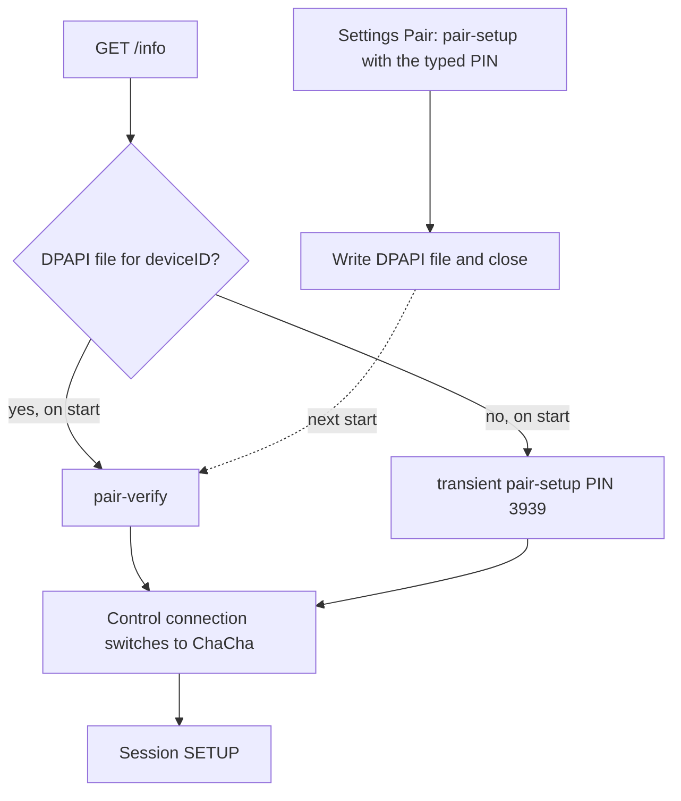

# Authentication

Every playback member and pairing attempt begins with plaintext `GET /info` on the supplied peer TCP port (default 7000, not a fixed port). Playback chooses saved credentials or transient setup using `/info` `deviceID`. Missing/non-string/empty playback identity skips loading and chooses transient. Once `load` sees `path.exists() == true`, metadata/read/decrypt/parse failures abort without transient fallback. An inaccessible existence probe can return false and appear absent; [Credentials and IPC](credentials-and-ipc.md) documents that distinction ([session.rs:220–251](https://github.com/Ding-Kyoma/AirFlash/blob/41190e0d13a63a714c08dffe73ababca1804875c/native/airflash-engine/src/session.rs#L220), [credentials.rs:105–121](https://github.com/Ding-Kyoma/AirFlash/blob/41190e0d13a63a714c08dffe73ababca1804875c/native/airflash-engine/src/credentials.rs#L105)). Pairing requires a string `deviceID` but does not reject an empty string before saving ([main.rs:265–297](https://github.com/Ding-Kyoma/AirFlash/blob/41190e0d13a63a714c08dffe73ababca1804875c/native/airflash-engine/src/main.rs#L265)). The subsequent SETUP is in [Engine](engine.md).

The setup/verify messages use TLV8 bodies and `Content-Type: application/octet-stream`; `/pair-pin-start` has an empty body. `/pair-` paths use HTTP rather than RTSP. A TLV field 7 fails decoding as a pairing rejection. Repeated tags are concatenated, and truncated headers/values are rejected. The encrypted identity submessages use ChaCha20-Poly1305 and an 8-byte nonce label in the last eight bytes of a 12-byte nonce; the SRP prefix itself is plaintext ([crypto.rs:67–114](https://github.com/Ding-Kyoma/AirFlash/blob/41190e0d13a63a714c08dffe73ababca1804875c/native/airflash-engine/src/crypto.rs#L67), [rtsp.rs:278–283](https://github.com/Ding-Kyoma/AirFlash/blob/41190e0d13a63a714c08dffe73ababca1804875c/native/airflash-engine/src/rtsp.rs#L278)).

## Shared SRP prefix

`srp_handshake_prompt` is the prefix of both setup paths.

1. `POST /pair-pin-start` with an empty body. Transient sends `X-Apple-HKP: 4`. Persistent sends `X-Apple-HKP: 3`.
2. `POST /pair-setup` state 1. Transient also sends TLV `0x13 = 0x10`. Persistent omits that flag.
3. The accessory must answer state 2. After checking that state, the engine asks for the PIN; only after PIN validation does it require the salt and public key. For persistent setup this is when `pin_required` is emitted, before SRP M3/M4.
4. The PIN must contain 4–8 ASCII digits. Transient uses fixed PIN `3939` and does not ask the UI. Persistent waits on its internal PIN channel after notifying the desktop. The SRP salt must be nonempty and at most 64 bytes, and the server public value must be nonempty, at most 384 bytes, and nonzero modulo the SRP prime. A zero scrambling parameter is rejected.
5. The client sends state 3 with its public value and proof, then requires state 4 and a server proof that matches in constant time.

The result is the SRP session key. Transient stops here; persistent continues into the identity exchange. The code uses the 3072-bit group, generator 5, SHA-512, and `Pair-Setup` as the SRP username ([auth.rs:12–24,47–91,96–138](https://github.com/Ding-Kyoma/AirFlash/blob/41190e0d13a63a714c08dffe73ababca1804875c/native/airflash-engine/src/auth.rs#L12)).

## Transient setup, on start with no file

`transient` enables the control cipher from the SRP key and returns that key. Nothing is written to disk. The accessory is not remembered. The next `start` with no file repeats this exchange.

Control keys are HKDF-SHA512:

| Direction | Salt | Info |
| --- | --- | --- |
| Engine write | `Control-Salt` | `Control-Write-Encryption-Key` |
| Engine read | `Control-Salt` | `Control-Read-Encryption-Key` |

From this point the control socket speaks HAP records. A bad incoming tag raises `WireError::Authentication`, ending the playback/member path. The parser does not set its `poisoned` flag on a receive/tag error; that flag is set when a socket write fails ([rtsp.rs:122–160,177–194](https://github.com/Ding-Kyoma/AirFlash/blob/41190e0d13a63a714c08dffe73ababca1804875c/native/airflash-engine/src/rtsp.rs#L122)).

## Persistent setup, the Pair button

`pair_prompt` uses the persistent SRP prefix, then:

1. Draws a new Ed25519 controller key and a new UUID controller id.
2. Derives the controller-sign bytes from the SRP key (`Pair-Setup-Controller-Sign-Salt` / `Pair-Setup-Controller-Sign-Info`), then signs `derived bytes || id || public` with the new Ed25519 private key. The HKDF bytes are part of the signed message, not the Ed25519 signing key.
3. Seals that identity as pairing state 5 with label `PS-Msg05`.
4. Requires state 6, opens it with label `PS-Msg06`, and checks the accessory Ed25519 signature over `accessory-sign-info || accessory id || accessory public`.
5. Returns `Credentials`: accessory id bytes, 32-byte accessory public key, controller id bytes, and 32-byte controller secret. The authenticated accessory id from M6 is distinct from the `/info` `deviceID` used for the filename; the code does not compare the two during pairing ([auth.rs:163–235](https://github.com/Ding-Kyoma/AirFlash/blob/41190e0d13a63a714c08dffe73ababca1804875c/native/airflash-engine/src/auth.rs#L163)).

This connection does not call `enable_control` and does not send SETUP. The engine writes the DPAPI file and emits `paired`. The desktop closes that process. Playback is a later process, which loads the file and uses pair-verify.

The desktop opens one pairing process per member, leader first. A blank/cancelled dialog result publishes Idle and does not send `start`. The engine and desktop each set a 120-second PIN wait; the engine polls cancellation every 100 ms. A desktop PIN-token timeout throws through `PinDialog` and may publish Error, rather than the blank-result Idle path ([main.rs:272–291](https://github.com/Ding-Kyoma/AirFlash/blob/41190e0d13a63a714c08dffe73ababca1804875c/native/airflash-engine/src/main.rs#L272), [SessionController.cs:396–427](https://github.com/Ding-Kyoma/AirFlash/blob/41190e0d13a63a714c08dffe73ababca1804875c/desktop/AirFlash.Core/SessionController.cs#L396)).

The dialog enables Pair when the box holds 4–8 ASCII digits and every other character is a dash (text box maximum 16 characters). It sends the text unchanged. The engine requires the entire string to be 4–8 bytes and all digits, so a dash the dialog permits is rejected as `PIN must contain 4..8 digits` ([PinDialog.cs:10–36](https://github.com/Ding-Kyoma/AirFlash/blob/41190e0d13a63a714c08dffe73ababca1804875c/desktop/AirFlash.App/Ui/PinDialog.cs#L10), [auth.rs:113–117](https://github.com/Ding-Kyoma/AirFlash/blob/41190e0d13a63a714c08dffe73ababca1804875c/native/airflash-engine/src/auth.rs#L113)).

## Pair-verify, on start with a file

`verify` does not use the SRP PIN.

1. `POST /pair-verify` state 1 with a fresh X25519 public key and `X-Apple-HKP: 3`.
2. Requires state 2, the accessory public key, and an encrypted blob.
3. Derives the shared secret. A non-contributory X25519 key fails.
4. Opens the blob with label `PV-Msg02` under `Pair-Verify-Encrypt-Salt` / `Pair-Verify-Encrypt-Info`.
5. Requires the accessory id inside the blob to equal the id stored in the file, and checks the accessory signature over `peer public || accessory id || our public`.
6. Signs `our public || controller id || peer public` with the stored controller secret, seals it as state 3 with label `PV-Msg03`, and requires state 4.

The control cipher is then enabled from the X25519 shared secret, not from an SRP key. The same Control-Salt names are used. Event and audio keys are derived later from this same secret: events-read, events-write, and the RTP key, which is the events-write key. Those derivations are in [Engine](engine.md).

## Failures

A missing salt, bad state, invalid PIN, SRP proof mismatch, accessory id mismatch, or signature mismatch returns an error. During playback, `Fault::from_error` runs on the authentication exchange and rewrites its generic `protocol_error` to `authentication_failed`, keeping retryable false. A socket closure, timeout, or other I/O failure during that same exchange keeps its transport code and can be retryable. Credential-load errors occur before this authentication wrapper and are classified by the outer `setup` wrapper; a DPAPI/load failure is not guaranteed the `authentication_failed` code ([session.rs:235–251,534–546](https://github.com/Ding-Kyoma/AirFlash/blob/41190e0d13a63a714c08dffe73ababca1804875c/native/airflash-engine/src/session.rs#L235), [transport.rs:63–110](https://github.com/Ding-Kyoma/AirFlash/blob/41190e0d13a63a714c08dffe73ababca1804875c/native/airflash-engine/src/transport.rs#L63)).

The desktop respects explicit `retryable: false` or true. Its authentication keyword scan is used only if the flag is absent. Persistent pairing failures use `error_event`'s keyword fallback unless already a structured `Fault`; pairing is not in the desktop playback-retry loop. PIN errors such as `PIN must contain 4..8 digits` and `PIN entry timed out` can therefore appear as `engine_error` with retryable true, although the pairing workflow still stops ([main.rs:305–310](https://github.com/Ding-Kyoma/AirFlash/blob/41190e0d13a63a714c08dffe73ababca1804875c/native/airflash-engine/src/main.rs#L305), [SessionController.cs:388,422](https://github.com/Ding-Kyoma/AirFlash/blob/41190e0d13a63a714c08dffe73ababca1804875c/desktop/AirFlash.Core/SessionController.cs#L388)).

A failed pair-verify never falls back to transient setup on that connection. Transient is chosen before the exchange when no credentials were loaded, including missing/empty `/info` identity. Persistent pairing replaces the file only after authenticated M6 succeeds.

## Source verification and coverage

Source audit of runtime baseline upstream `41190e0` in the `c077a05` documentation baseline. Existing tests are evidence of intended contracts; reading a test is not a record of executing it.

| Contract | Existing evidence |
| --- | --- |
| Independent SRP output and invalid server public key | [auth_vector.rs:9](https://github.com/Ding-Kyoma/AirFlash/blob/41190e0d13a63a714c08dffe73ababca1804875c/native/airflash-engine/tests/auth_vector.rs#L9), `independent_srp_vector`; [auth.rs:324–325](https://github.com/Ding-Kyoma/AirFlash/blob/41190e0d13a63a714c08dffe73ababca1804875c/native/airflash-engine/src/auth.rs#L324) |
| Persistent M6 signature required | [auth.rs:438–451](https://github.com/Ding-Kyoma/AirFlash/blob/41190e0d13a63a714c08dffe73ababca1804875c/native/airflash-engine/src/auth.rs#L438), `persistent_pair_requires_valid_accessory_signature` |
| Pair-verify checks accessory identity, controller proof, and encrypted control | [auth.rs:454–540](https://github.com/Ding-Kyoma/AirFlash/blob/41190e0d13a63a714c08dffe73ababca1804875c/native/airflash-engine/src/auth.rs#L454), `persistent_verify_encrypts_control_and_rejects_identity_swap` |
| TLV fragmentation/rejection and HAP length/sequence authentication | [crypto.rs:120–148](https://github.com/Ding-Kyoma/AirFlash/blob/41190e0d13a63a714c08dffe73ababca1804875c/native/airflash-engine/src/crypto.rs#L120) |
| Blank PIN stops playback; stereo pairs pair separately | [SessionTests.cs:226–238](https://github.com/Ding-Kyoma/AirFlash/blob/41190e0d13a63a714c08dffe73ababca1804875c/desktop/AirFlash.Tests/SessionTests.cs#L226) |

These tests use synthetic localhost accessories or fake desktop connections. They do not verify current HomePod firmware policies, successful on-device pairing, PIN UI timeout/dash handling, or production credential-file replacement. No real-device pairing or probe was performed in this audit.
