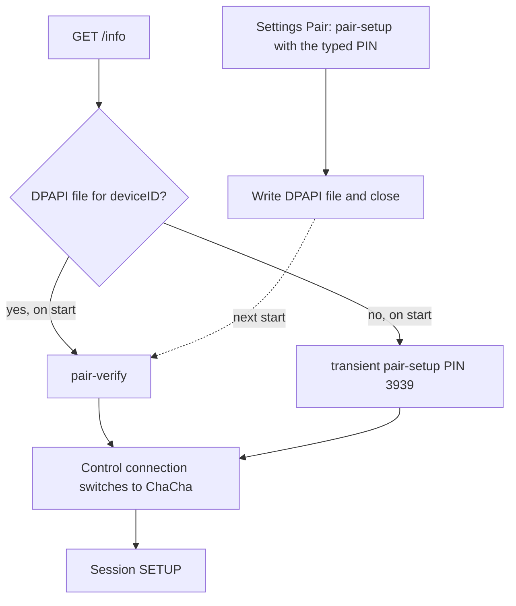

# Authentication

Every playback member and every pairing attempt starts with plaintext `GET /info` on TCP port 7000. The next step depends on whether `%APPDATA%\AirFlash\native-credentials\` already contains a file for the `deviceID` in that plist. The file format is in [Credentials and IPC](credentials-and-ipc.md). The SETUP that follows a successful playback authentication is in [Engine](engine.md).

All three paths use TLV8 bodies, `Content-Type: application/octet-stream`, and HTTP rather than RTSP because the path starts with `/pair-`. A TLV field 7 is a protocol rejection and fails the call. Pairing messages are sealed with ChaCha20-Poly1305 and an 8-byte nonce label in the last eight bytes of a 12-byte nonce.

## Shared SRP prefix

`srp_handshake_prompt` is the prefix of both setup paths.

1. `POST /pair-pin-start` with an empty body. Transient sends `X-Apple-HKP: 4`. Persistent sends `X-Apple-HKP: 3`.
2. `POST /pair-setup` state 1. Transient also sends TLV `0x13 = 0x10`. Persistent omits that flag.
3. The accessory must answer state 2 with a salt and a public key.
4. The PIN is checked: 4–8 ASCII digits. Transient uses the fixed PIN `3939` and does not ask the UI. Persistent calls the desktop, which waited on `pin_required`.
5. The client sends state 3 with its public value and proof, then requires state 4 and a server proof that matches in constant time.

The result is the SRP session key. Transient stops here. Persistent continues into the identity exchange.

## Transient setup, on start with no file

`transient` enables the control cipher from the SRP key and returns that key. Nothing is written to disk. The accessory is not remembered. The next `start` with no file repeats this exchange.

Control keys are HKDF-SHA512:

| Direction | Salt | Info |
| --- | --- | --- |
| Engine write | `Control-Salt` | `Control-Write-Encryption-Key` |
| Engine read | `Control-Salt` | `Control-Read-Encryption-Key` |

From this point the control socket speaks HAP records. A bad tag poisons the connection.

## Persistent setup, the Pair button

`pair_prompt` uses the persistent SRP prefix, then:

1. Draws a new Ed25519 controller key and a new UUID controller id.
2. Signs `controller-sign-info || id || public` under the key derived from the SRP result (`Pair-Setup-Controller-Sign-Salt` / `Pair-Setup-Controller-Sign-Info`).
3. Seals that identity as pairing state 5 with label `PS-Msg05`.
4. Requires state 6, opens it with label `PS-Msg06`, and checks the accessory Ed25519 signature over `accessory-sign-info || accessory id || accessory public`.
5. Returns `Credentials`: accessory id, accessory public key, controller id, controller secret.

This connection does not call `enable_control` and does not send SETUP. The engine writes the DPAPI file and emits `paired`. The desktop closes that process. Playback is a later process, which loads the file and uses pair-verify.

The desktop opens one pairing process per member, leader first. A blank PIN cancels the attempt and does not send `start`. The wait is 120 seconds in the engine and 120 seconds in the desktop dialog. The dialog enables Pair when the box holds 4–8 ASCII digits and every other character is a dash. The engine accepts the string only when its whole length is 4–8 and every byte is a digit, so a dash the dialog allowed is rejected as `PIN must contain 4..8 digits`.

## Pair-verify, on start with a file

`verify` does not use the SRP PIN.

1. `POST /pair-verify` state 1 with a fresh X25519 public key and `X-Apple-HKP: 3`.
2. Requires state 2, the accessory public key, and an encrypted blob.
3. Derives the shared secret. A non-contributory X25519 key fails.
4. Opens the blob with label `PV-Msg02` under `Pair-Verify-Encrypt-Salt` / `Pair-Verify-Encrypt-Info`.
5. Requires the accessory id inside the blob to equal the id stored in the file, and checks the accessory signature over `peer public || accessory id || our public`.
6. Signs `our public || controller id || peer public` with the stored controller secret, seals it as state 3 with label `PV-Msg03`, and requires state 4.

The control cipher is then enabled from the X25519 shared secret, not from an SRP key. The same Control-Salt names are used. Event and audio keys are derived later from this same secret: events-read, events-write, and the RTP key, which is the events-write key. Those derivations are in [Engine](engine.md).

## Failures

A missing salt, a bad state byte, a short PIN, an SRP proof mismatch, an accessory id mismatch, or a signature mismatch returns an error. The engine marks authentication failures `retryable: false`. The desktop also treats a message that mentions pairing, SRP, verification, credentials, signature, identity, or authentication as final, even when force reconnect is on. The attempt does not fall back from a failed pair-verify to transient setup in the same connection. A missing file is the only path into transient setup, and it is chosen before either exchange starts.
