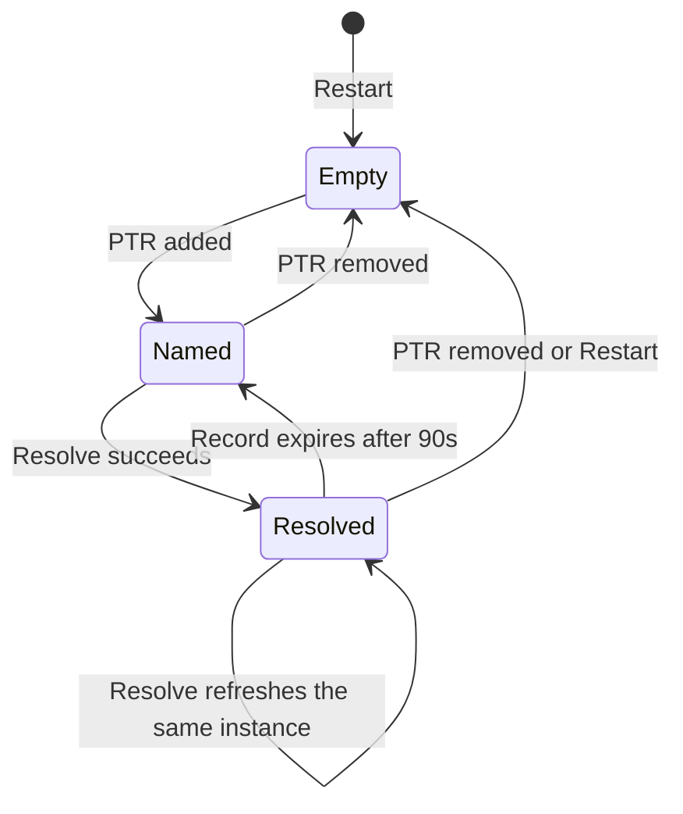

# Discovery

Discovery is a long-lived Windows DNS-SD browse in the WPF process. The implementation is [`WindowsDiscovery`](../../desktop/AirFlash.App/Services/WindowsDiscovery.cs). It uses `dnsapi.dll` directly. AirFlash does not install Bonjour and does not run a discovery service of its own.

The output of this stage is a list of [`ServiceRecord`](../../desktop/AirFlash.Core/Receiver.cs) values: instance name, service type, one IPv4 address, port, and TXT. Turning those records into receiver rows is [the next stage](after-discovery.md).

## When browsing starts

The view model stores the saved adapter id before the window is shown. `Start` runs later, after startup settings work finishes. `Start` subscribes to `NetworkChange.NetworkAddressChanged` and `NetworkChange.NetworkAvailabilityChanged`, calls `Restart`, and arms a 20-second timer.

`SetInterface` before `Start` only remembers the id. A change after `Start` calls `Restart` when the id differs. Applying a new adapter in Settings is that call. See [After discovery](after-discovery.md) for the catalog effect of the empty result `Restart` publishes.

## Which interface is queried

[`NetworkAdapterCatalog`](../../desktop/AirFlash.App/Services/NetworkAdapterCatalog.cs) lists every non-loopback adapter, including adapters that are down, so a saved choice can still explain a pause. Each entry carries the NIC id, name, description, IPv4 addresses, operational status, and IPv4 interface index.

[`DiscoveryInterface.ResolveIndex`](../../desktop/AirFlash.Core/Receiver.cs) maps the saved id:

| Saved id | Result |
| --- | --- |
| Empty | Interface index `0`, which asks Windows to browse every interface |
| Id of an up adapter that has an IPv4 address and a non-zero index | That adapter's IPv4 index |
| Missing, down, or address-less id | `null` |

A `null` index is never rewritten to `0`. A vanished Wi-Fi adapter does not fall back to browsing virtual adapters. `Restart` then publishes an empty record list and raises `Failed` with "The selected network interface is unavailable. Discovery is paused."

The index is passed to both `DnsServiceBrowse` and `DnsServiceResolve`. It filters advertisements. It is not later applied to the audio sockets. The engine binds those from the source address of its own TCP connection. See [Engine](engine.md).

Settings → Network shows the same choice. Available adapters are listed above unavailable ones. The status line reports all interfaces, the selected interface, or a pause. That status is display only. The browse itself is updated when the setting is applied and `SetInterface` runs.

## The browse

`Restart` increments an epoch, cancels every operation this owner still has, clears browsers, resolved records, instance names, and in-flight resolves, then publishes the empty cache. It does that before opening the new browse. The two queries are:

- `_airplay._tcp.local`
- `_raop._tcp.local`

`DnsServiceBrowse` status `0` or `9506` (pending) is success. Any other status raises `Failed` and the user can add a receiver manually. The browse operation stays open until the next restart or until dispose.

Callbacks enter through static thunks. The native context is an integer token in a process-wide table, not a managed pointer. If the operation was already removed, the callback frees the DNS memory and returns. If the operation's epoch is no longer current, the callback is ignored. That drops results from a browse that `Restart` already replaced.

Each callback walks a `DNS_RECORDW` list and keeps PTR records, type 12. The code reads the type at byte offset 16 and the flags at offset 24.

- Flags `0` remove that instance name, its resolved record, and any in-flight resolve immediately.
- Any other PTR stores "this instance belongs to this service type" and starts a resolve, unless a resolve for that name is already in flight.

A browse callback publishes after it has processed the whole record list. Resolved data may still be absent, so a publish at this moment often contains the same speakers as the previous one. The UI still receives the event. [After discovery](after-discovery.md) describes how identical lists are handled.

## The resolve

`DnsServiceResolve` runs on the same interface index. The result must include a non-null IPv4 pointer, a non-zero port, and at most 256 TXT pairs. The code copies four address bytes. The hostname and the IPv6 pointer on the service instance are left unused.

TXT keys are stored case-insensitively. A successful record replaces the previous one and its expiry becomes 90 seconds from now. The log line `Discovery resolved:` is written when the instance, type, address, port, `deviceid`, model, or `tsid` changed.

A failed resolve removes the pending token and frees the operation. The previous record stays until its 90-second expiry. A resolve that is still pending is not started again for that instance.

## Cache lifetime

The 20-second timer does two different jobs:

- If a specific adapter is selected and its interface index no longer matches the index used for the current browse, the timer calls `Restart`. The cache is cleared and an empty list is published.
- Otherwise it deletes records whose 90-second expiry has passed, publishes what remains, and re-resolves every instance the browse still knows.

A speaker that disappears from the browse is removed on the removal callback. A speaker whose resolve starts failing remains visible until those 90 seconds elapse. A network-address change, a network-availability change, an adapter switch, and the first `Start` all take the `Restart` path, so the next result the UI sees is an empty list, then whatever the new browse resolves.

`NetworkChanged` and `NetworkAvailabilityChanged` call `Restart` with no look at which adapter changed. A virtual adapter, an IPv6 address refresh, or an unrelated NIC can clear the HomePod cache. The handler does not compare the previous IPv4 address with the new one.

### A resolve that never calls back

`Resolve` records the instance in `_pending` and skips a second resolve while that entry exists. `Start` removes the entry when the status is neither `0` nor `9506`. A callback removes it inside `Resolved`.

`Refresh` does not. When a record expires it deletes `_records` and `_instances` for that name and leaves `_pending` in place. The following details follow from that order:

- The next `Refresh` only re-resolves names still in `_instances`, so the expired name is not queried again.
- A later browse callback that still sees the PTR calls `Resolve`, and `Resolve` returns immediately because `_pending` still contains the name.
- A callback that arrives after the expiry removes `_pending`, then returns without storing the record because `_instances` no longer contains the name.
- The name is queried again after a browse removal (`flags == 0` clears `_pending`) followed by a new PTR, or after `Restart`, which clears `_pending` along with everything else.

A hung `DnsServiceResolve` can therefore drop a speaker from the published list and refuse further resolves for that instance until one of those two recoveries.

### What a repeated resolve log means

`Discovery resolved:` is written when the instance is absent from `_records`, or when `Describe` differs. `Describe` is the instance, service type, address, port, `deviceid`, model, and `tsid`. An identical line logged again means that name was missing from the cache. `Restart` produces that miss for every speaker at once. So does a removal followed by a later resolve. The log line does not say which path ran, because `Restart` itself is not logged.

The workspace log `wpf-2026-10-06.log` contains 88 of these lines and 8 distinct descriptions. Each description is repeated, one of them 12 times, and there are 10 windows of 8 seconds that each contain at least 4 distinct resolves. That is the cache-miss pattern. It is not, by itself, a record of the HomePod rebooting. What that empty publish does to playback is in [Playback coupling](playback-coupling.md).

`Dispose` unsubscribes from network events, stops the timer, bumps the epoch, and cancels outstanding operations. Shutdown does this before it waits for the session to end.

## Fields the resolve keeps

Later stages read these TXT keys. Anything else is retained on the record and ignored by the aggregator.

| TXT key | Role |
| --- | --- |
| `deviceid` | Physical identity. A 12-digit hex MAC is normalized to lowercase without separators |
| RAOP instance text before `@` | Identity when `deviceid` is empty. The text after `@` is the display name |
| `model`, otherwise `am` | Model string. AirPlay is preferred over RAOP when both exist |
| `tsid` | Stereo group id. The row id becomes `stereo:{tsid}` |
| `gpn` | Group display name |
| `igl` | `1` marks the group leader |
| `pk` | Public key, used only to refuse a merge when two records disagree. Comparison is case-sensitive |
| `cn` | Codec list. Read only from RAOP records and later sent to the engine |
| `gid` | Present on advertisements and unused. Tests keep it unstable on purpose so grouping depends on `tsid` |

The address stored for the speaker is the single IPv4 address Windows returned. A hostname is not kept, and a second A record is not queried.

## Failures during browse

`Failed` is raised for an adapter-catalog error, a browse or resolve start status other than `0` or `9506`, an exception in a callback, and a paused selection. The view model shows that text as a notice. `Failed` does not edit the receiver map. The empty publish that precedes a pause does. See [After discovery](after-discovery.md).

Manual receivers never come from this cache. They are inserted from settings after every discovery result.

## Check mode

`AirFlash.exe --discovery-check` constructs a `WindowsDiscovery`, calls `Start`, waits eight seconds, and writes the aggregated receiver list and any failure strings. That path is read-only: it does not open the engine and does not connect to a speaker.
