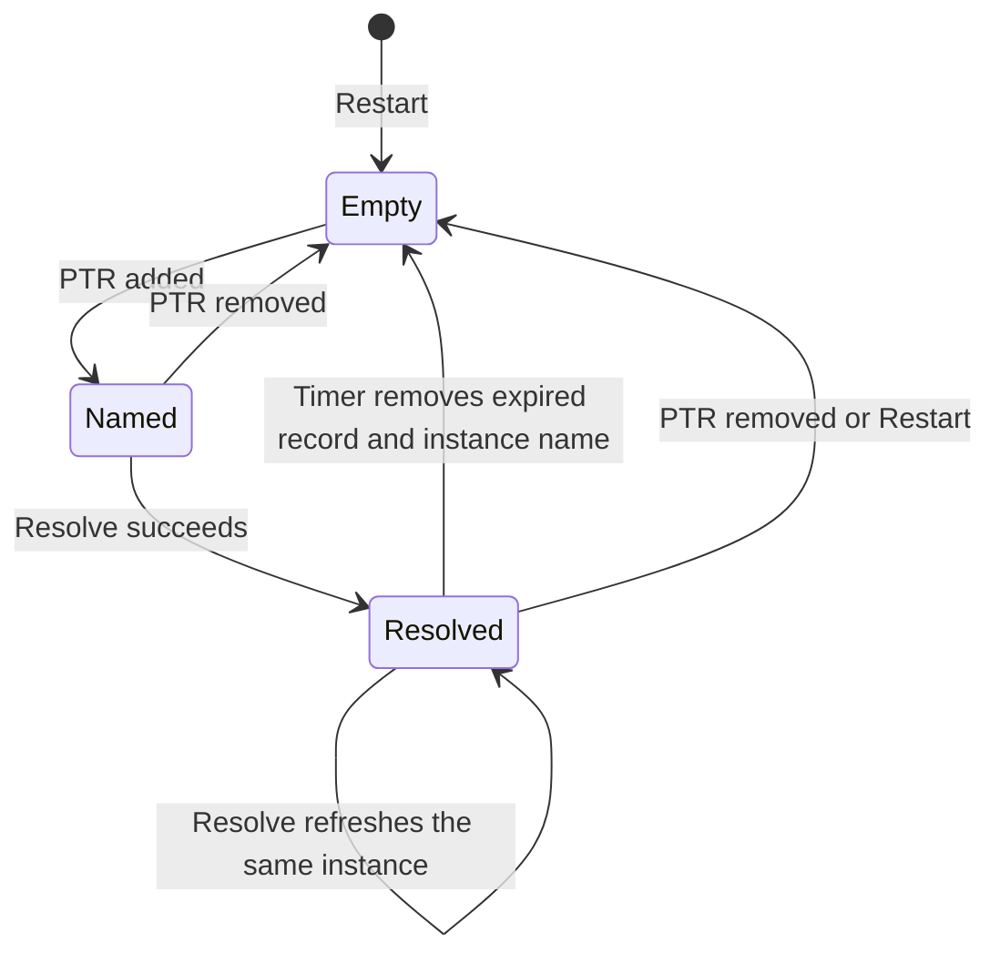

# Discovery

Discovery is a long-lived Windows DNS-SD browse in the WPF process. The implementation is [`WindowsDiscovery`](../../desktop/AirFlash.App/Services/WindowsDiscovery.cs). It uses `dnsapi.dll` directly. AirFlash does not install Bonjour and does not run a discovery service of its own.

The cache contains [`ServiceRecord`](../../desktop/AirFlash.Core/Receiver.cs#L26) values: instance name, service type, one IPv4 address, port, and TXT. `Publish` aggregates them into `Receiver` rows before raising `Changed`; the event does not expose raw service records. Aggregation and the desktop reconciliation that follows are described in [After discovery](after-discovery.md).

## When browsing starts

The view model stores the saved adapter id before the window is shown. `Start` runs later, after startup settings work finishes. `Start` subscribes to `NetworkChange.NetworkAddressChanged` and `NetworkChange.NetworkAvailabilityChanged`, calls `Restart`, and arms a 20-second timer.

`SetInterface` before `Start` only remembers the id. A change after `Start` calls `Restart` when the id differs. Applying a new adapter in Settings is that call. See [After discovery](after-discovery.md) for the catalog effect of the empty result `Restart` publishes.

## Which interface is queried

[`NetworkAdapterCatalog`](../../desktop/AirFlash.App/Services/NetworkAdapterCatalog.cs) lists every non-loopback adapter, including adapters that are down, so a saved choice can still explain a pause. Each entry carries the NIC id, name, description, IPv4 addresses, operational status, and IPv4 interface index.

[`DiscoveryInterface.ResolveIndex`](../../desktop/AirFlash.Core/Receiver.cs) maps the saved id:

| Saved id | Result |
| --- | --- |
| Empty | Interface index `0`, which asks Windows to browse every interface |
| Id of an up adapter that has an IPv4 address and a non-zero index | That adapter's IPv4 index |
| Missing, down, or address-less id | `null` |

A `null` index is never rewritten to `0`. A vanished Wi-Fi adapter does not fall back to browsing virtual adapters. `Restart` then publishes an empty record list and raises `Failed` with "The selected network interface is unavailable. Discovery is paused."

The index is passed to both `DnsServiceBrowse` and `DnsServiceResolve`. It selects the interface for those DNS-SD queries and is not passed to the engine. The media audio/control UDP sockets use the local address of the engine's TCP connection; PTP and the separate NTP responder bind wildcard addresses. See [Engine](engine.md). Microsoft's [browse request](https://learn.microsoft.com/en-us/windows/win32/api/windns/ns-windns-dns_service_browse_request) and [resolve request](https://learn.microsoft.com/en-us/windows/win32/api/windns/ns-windns-dns_service_resolve_request) documentation confirm that index `0` considers all interfaces.

Settings → Network shows the same choice. Available adapters are listed above unavailable ones. The status line reports all interfaces, the selected interface, or a pause. That status is display only. The browse itself is updated when the setting is applied and `SetInterface` runs.

## The browse

`Restart` increments an epoch and clears browsers, resolved records, instance names, and pending markers under the cache lock. Outside that lock it disposes every operation this owner still has, requesting native cancellation for operations whose start returned pending, then publishes the cleared cache. It does that before opening that epoch's new browse. The two queries are:

- `_airplay._tcp.local`
- `_raop._tcp.local`

AirFlash accepts `DnsServiceBrowse` start status `0` or `9506` (`DNS_REQUEST_PENDING`). Any other start status raises `Failed` and the user can add a receiver manually. Microsoft documents [successful asynchronous browse](https://learn.microsoft.com/en-us/windows/win32/api/windns/nf-windns-dnsservicebrowse) as returning `DNS_REQUEST_PENDING`; accepting `0` is an implementation choice. Browse operations remain tracked until the next restart or dispose, including an operation whose start failed. A nonzero status delivered to `Browse` itself is silently ignored, with the returned record memory still freed.

Callbacks enter through static thunks. The native context is an integer token in a process-wide table, not a managed pointer. If the operation was already removed, the callback frees the DNS memory and returns. Epoch checks reject cache mutations from replaced operations; a browse callback checks the epoch while processing each PTR, whereas a resolve callback checks it before reading its result.

Each callback walks a `DNS_RECORDW` list and keeps PTR records, type 12. The code reads the type at byte offset 16 and the flags at offset 24.

- Flags `0` remove that instance name, its resolved record, and its `_pending` marker immediately. This branch does not cancel or dispose the native resolve operation. A late completion is rejected unless its token still matches; restart/dispose also clean up retained operations.
- Any other PTR stores "this instance belongs to this service type" and starts a resolve, unless a resolve for that name is already in flight.

A successful browse callback publishes after it has processed the whole record list. Resolved data may still be absent, so a publish at this moment can contain the same speakers as the previous one. The UI still receives the event. [After discovery](after-discovery.md) describes how identical lists are handled. The flags test describes AirFlash's branch, not a verified guarantee that Windows sends a flags-zero callback whenever a receiver disappears; this audit did not test removal delivery on a live network.

## The resolve

`DnsServiceResolve` runs on the same interface index. The result must include a non-null IPv4 pointer and a non-zero port, and `Count > 256` is rejected. The code copies four address bytes. The hostname and the IPv6 pointer on the service instance are left unused. The [native instance](https://learn.microsoft.com/en-us/windows/win32/api/windns/ns-windns-dns_service_instance) declares the property count as an unsigned DWORD; AirFlash marshals it as signed `int` and does not separately reject negative values or validate the key/value array pointers. This is a source-level validation limit, not a demonstrated malformed Windows callback.

TXT keys are stored case-insensitively. A successful record replaces the previous one and its expiry becomes 90 seconds from now. The log line `Discovery resolved:` is written when the instance, type, address, port, `deviceid`, model, or `tsid` changed.

A resolve whose start returns neither `0` nor `9506` removes its pending token and disposes the operation without raising `Failed`. A nonzero completion status or unusable result also removes the token, frees the result, and completes the operation without raising `Failed`. The previous record stays until expiry is processed. A resolve that is still pending is not started again for that instance.

## Cache lifetime

The 20-second timer does two different jobs:

- If a specific adapter is selected and its interface index no longer matches the index used for the current browse, the timer calls `Restart`. The cache is cleared and an empty list is published.
- Otherwise it deletes records whose 90-second expiry has passed, publishes what remains, and re-resolves every instance the browse still knows.

A flags-zero PTR callback removes that instance immediately. A speaker whose refresh resolves fail remains visible until the first timer tick that observes its 90-second expiry; 90 seconds is the stored deadline, not a separate precise eviction timer. A network-address change, a network-availability change, an adapter switch, and the first `Start` all take the `Restart` path, which publishes the cleared cache before starting that epoch's new browse.

`NetworkChanged` and `NetworkAvailabilityChanged` call `Restart` with no look at which adapter changed. A virtual adapter, an IPv6 address refresh, or an unrelated NIC can clear the HomePod cache. The handler does not compare the previous IPv4 address with the new one.

### A resolve that never calls back

`Resolve` records the instance in `_pending` and skips a second resolve while that entry exists. `Start` removes the entry when the status is neither `0` nor `9506`. A callback removes it inside `Resolved`.

`Refresh` does not. When a record expires it deletes `_records` and `_instances` for that name and leaves `_pending` in place. The following details follow from that order:

- The next `Refresh` only re-resolves names still in `_instances`, so the expired name is not queried again.
- A later browse callback that still sees the PTR calls `Resolve`, and `Resolve` returns immediately because `_pending` still contains the name.
- A callback that arrives after expiry removes `_pending`. If no subsequent PTR restored `_instances` for that name, it returns without storing a record. If a subsequent PTR did restore the name, that same pending resolve can still supply a fresh record.
- The name is queried again after a browse removal (`flags == 0` clears `_pending`) followed by a new PTR, or after `Restart`, which clears `_pending` along with everything else.

A resolve that never completes can therefore drop a previously resolved speaker from the published list and refuse further resolves for that instance until removal plus a new PTR, or restart. If the very first resolve never completes, there is no cached record to expire: the name and `_pending` marker remain, and each refresh skips another resolve. There is no resolve deadline or watchdog here. A late successful callback is another recovery when `_instances` still contains, or a newer PTR has restored, that name. Without that name, the late callback only clears `_pending`; another PTR is then needed to trigger a new resolve.

### What a repeated resolve log means

`Discovery resolved:` is written when the instance is absent from `_records`, or when `Describe` differs. `Describe` includes the instance, service type, address, port, `deviceid`, model (the `model` key, otherwise `am` if that key is absent), and `tsid`. An identical description appearing again can reflect a cache miss, or a description that changed and then returned to its earlier value. `Restart`, expiry, and a removal can cause a cache miss. The log does not identify which path ran, and simultaneous resolve logs do not prove a network trigger or a receiver reboot. What an empty publish does to playback is in [Playback coupling](playback-coupling.md).

`Dispose` unsubscribes from network events, stops the timer, bumps the epoch, and cancels outstanding operations. Shutdown does this before it waits for the session to end.

## Fields the resolve keeps

Later stages read these TXT keys. Anything else is retained on the record and ignored by the aggregator.

| TXT key | Role |
| --- | --- |
| `deviceid` | Physical identity. A 12-digit hex MAC is normalized to lowercase without separators |
| RAOP instance text before `@` | Identity when `deviceid` is empty. The text after `@` is the display name |
| `model`, otherwise `am` | Model string. AirPlay is preferred over RAOP when both exist |
| `tsid` | Stereo group id. The row id becomes `stereo:{tsid}` |
| `gpn` | Group display name |
| `igl` | `1` marks the group leader |
| `pk` | Public key, used in the compatible-endpoint merge check. Comparison is case-sensitive; same-identity merges bypass this check |
| `cn` | Codec list. Read only from RAOP records and later sent to the engine |
| `gid` | Unused by the aggregator. The discovery-test fixture supplies `gid=unstable` while grouping uses `tsid=stable` |

The address stored for the speaker is the single IPv4 address Windows returned. A hostname is not kept, and a second A record is not queried.

## Failures during browse

`Failed` is raised for a caught `NetworkInformationException` from the adapter catalog, a browse start status other than `0` or `9506`, a caught exception in a callback, and a paused selection. Resolve start/completion statuses and nonzero browse callback statuses do not raise it. The view model shows the text as a notice. `Failed` does not edit the receiver map. The empty publish that precedes a pause does. See [After discovery](after-discovery.md).

Manual receivers never come from this cache. They are inserted from settings after every discovery result.

## Check mode

`AirFlash.exe --discovery-check` constructs a `WindowsDiscovery`, calls `Start`, waits eight seconds, and writes the aggregated receiver list and any failure strings. That path is read-only: it does not open the engine and does not connect to a speaker.

## Source and verification scope

The audited code is the `41190e0` runtime baseline retained by `c077a05`; see [the analysis index](README.md). The native PTR offsets assume x64, matching the app's `win-x64` runtime target.

| Claim group | Source anchors |
| --- | --- |
| Startup, saved interface, shutdown order | [`AppViewModel.cs:83–118, 420–428`](../../desktop/AirFlash.App/ViewModels/AppViewModel.cs#L83) |
| Adapter enumeration and no fallback | [`NetworkAdapterCatalog.cs:8–25`](../../desktop/AirFlash.App/Services/NetworkAdapterCatalog.cs#L8), [`Receiver.cs:110–123`](../../desktop/AirFlash.Core/Receiver.cs#L110) |
| Restart, timer, PTR flags and pending resolves | [`WindowsDiscovery.cs:27–134`](../../desktop/AirFlash.App/Services/WindowsDiscovery.cs#L27) |
| Result validation, logging, publication, disposal | [`WindowsDiscovery.cs:136–245`](../../desktop/AirFlash.App/Services/WindowsDiscovery.cs#L136) |
| Network Settings and check flag | [`SettingsViewModel.cs:278–309`](../../desktop/AirFlash.App/ViewModels/SettingsViewModel.cs#L278), [`App.xaml.cs:149–166`](../../desktop/AirFlash.App/App.xaml.cs#L149) |
| x64 target | [`AirFlash.App.csproj:10`](../../desktop/AirFlash.App/AirFlash.App.csproj#L10) |

[`DiscoveryTests.SelectedInterfaceNeverFallsBackToAllWhenMissingOrDisconnected`](../../desktop/AirFlash.Tests/DiscoveryTests.cs#L9) covers pure interface selection. `AirFlash.Tests` references Core, not the WPF project; its discovery tests do not exercise `dnsapi.dll`, native cancellation races, the 20-second timer, hung callbacks, or flags-zero removal delivery. Those behavior paths are verified by source inspection here, not by a live receiver experiment.

## Locally tested Group B behavior

The preceding audit remains the description of stable `41190e0`. This addendum describes local branch `codex/fix-session-lifecycle`, tested head `342aeb77cb85ff6f3f7f850161b3db79d8637945`, based directly on that stable commit. Group B has not been pushed or integrated. See the [acceptance checklist](../issues/GROUP-B-ACCEPTANCE.md).

Group B changes desktop handling after publication. Empty, incomplete or repeated browse results, including adapter restart, preserve the active handshake/transport while catalog rows continue to describe current discovery availability. The panel overlays an owned active card with an availability label and Stop; it does not claim that an absent receiver was rediscovered.

Browse, resolve, expiry and native DNS cancellation code are unchanged; DNS deadlines remain separate Group D work. The selected discovery interface still has no fallback when unavailable and still does not bind playback egress. The retained transport remains governed by worker health, explicit user actions and controller cleanup. The checklist records mock publication/adapter cases, without claiming live DNS, route or receiver validation.
