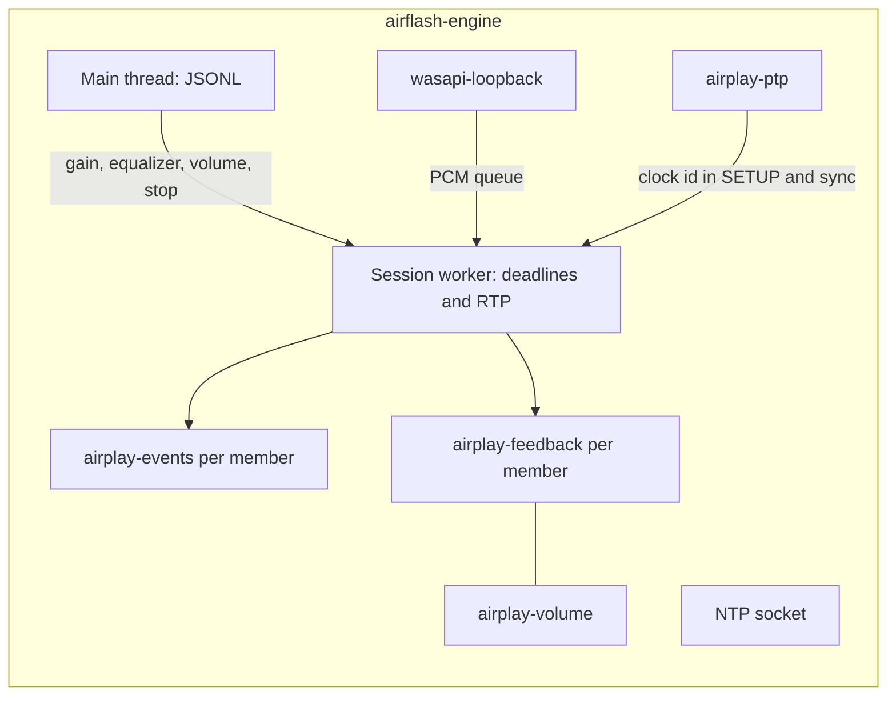

# Audio engine and the HomePod connection

`airflash-engine` is a Windows console process. Stdout carries JSONL version 1 events. One worker at a time owns playback/qualification started by `start`/`probe`, or persistent pairing started by `pair`. Worker completion/failure leaves the command loop alive; the desktop subsequently disposes the process. [Session](session.md) owns those rules. This document follows production `start` to teardown and labels differing probe/pair behavior ([main.rs:36–52,117–172,238–340](../../native/airflash-engine/src/main.rs#L36)).

Source map:

| Area | File |
| --- | --- |
| Command loop | [`main.rs`](../../native/airflash-engine/src/main.rs) |
| Handshake and send loop | [`session.rs`](../../native/airflash-engine/src/session.rs) |
| RTSP and HAP framing | [`rtsp.rs`](../../native/airflash-engine/src/rtsp.rs) |
| Pairing | [`auth.rs`](../../native/airflash-engine/src/auth.rs) |
| Credential files | [`credentials.rs`](../../native/airflash-engine/src/credentials.rs) |
| PTP | [`clock.rs`](../../native/airflash-engine/src/clock.rs) |
| RTP | [`rtp.rs`](../../native/airflash-engine/src/rtp.rs) |
| Feedback, events, retransmit | [`transport.rs`](../../native/airflash-engine/src/transport.rs) |
| Capture | [`live.rs`](../../native/airflash-engine/src/live.rs) |
| Device volume | [`volume.rs`](../../native/airflash-engine/src/volume.rs) |

The engine validates live `start` before replacing the previous worker: loopback source, duration zero, one/two distinct IPv4 peers with nonzero ports, rate 44100/48000, latency 0–2000 ms, finite gain 0–1, valid equalizer, and timing `ptp`/`ntp`. The desktop sends `ptp`. `start` also accepts probe-related fields, including `handshake_only`; the desktop does not send them. Finite `probe` requires duration 1–5000 ms, finite gain 0–0.1 and disabled equalizer. `pair` parses `Peer` but does not apply those IPv4/nonzero-port checks and does not create capture, PTP, or NTP ([session.rs:25–127](../../native/airflash-engine/src/session.rs#L25), [main.rs:117–154,238–297](../../native/airflash-engine/src/main.rs#L117)).

## Threads inside one playback

The main thread bounds command input at 65,536 bytes including newline, with no matching cap on native stdout. Commands target the stored session id. Unmatched gain/device-volume updates are ignored; unmatched equalizer updates return `equalizer_error`. A matching `stop` cancels and joins the worker; every stop, even nonmatching, replies `stopped`. EOF drops/joins the worker and exits. A valid second `start`, `probe`, or parsed `pair` drops/joins the previous worker before replacing it; validation failure leaves that worker in place. Full details are in [Credentials and IPC](credentials-and-ipc.md).

Feedback and device volume share the control connection's mutex. A slow `GET /info` delays the next feedback write, and a feedback wait holds volume.

## Clocks started before TCP

A local `Clock` anchors Unix time to a monotonic instant. RTP sync and PTP both read it. The Windows system clock is left unchanged.

For playback/probe, an NTP socket first binds `0.0.0.0` on an ephemeral port. It accepts only 32-byte datagrams from a session peer IP whose second byte masked by `0x7f` is `0x52`. The 32-byte reply is header `80 d3 00 07 00 00 00 00`, request bytes 24–31, receive timestamp, and send timestamp (eight bytes each). Production PTP SETUP does not advertise this port; NTP timing advertises `timingPort` instead of PTP peer information. This is a bounded AirPlay timing responder, not a general NTP server ([session.rs:154–193,523–531](../../native/airflash-engine/src/session.rs#L154)).

`PtpMaster` binds UDP 319 and 320 on every interface. If either bind fails, the attempt ends and no speaker is contacted. The clock id is random and fits in 63 bits. Every 125 ms the thread unicasts a sync and follow-up to each session peer. Every second it sends an announce. Delay requests from those peer addresses are answered. Packets from any other address are ignored.

## Per-member handshake

Members connect in the order `peers` was sent. The desktop puts the leader first. Both members later share one initial RTP timestamp. Each member draws its own sequence number and SSRC.

The control socket becomes nonblocking with `TCP_NODELAY` after a connect with a three-second budget. Ordinary requests have separate four-second write and response-read budgets, rather than a four-second whole-transaction limit. Windows chooses the source address; audio/control UDP bind to that local address. The selected discovery NIC is not passed into this connect ([rtsp.rs:89–109,122–160,307–328](../../native/airflash-engine/src/rtsp.rs#L89), [session.rs:220–255](../../native/airflash-engine/src/session.rs#L220)).

### Info and authentication

`GET /info` is plaintext RTSP. The engine reads `deviceID`, `model`, and `sourceVersion`. The version is emitted as `peer_info` and does not select a code path.

Nonempty string `deviceID` selects the DPAPI path in [Credentials and IPC](credentials-and-ipc.md). Missing/empty/non-string identity skips loading and chooses transient setup. After a true existence check, credential metadata/read/decrypt/parse errors abort without fallback; the existence check itself can hide access errors as absence. [Authentication](auth.md) specifies transient setup, persistent pairing, and pair-verify. Playback uses the first or third; the Pair button uses persistent setup in its own process without SETUP ([session.rs:231–251](../../native/airflash-engine/src/session.rs#L231), [credentials.rs:105–121](../../native/airflash-engine/src/credentials.rs#L105)).

Two results follow:

*   **Saved credentials.** Pair-verify uses `X-Apple-HKP: 3`. The engine sends an X25519 public key, opens the accessory's encrypted proof, requires the accessory id to match the file, checks the Ed25519 signature, and sends its own controller proof. The control keys come from that X25519 exchange.
*   **No file.** Transient pair-setup uses `X-Apple-HKP: 4`, `POST /pair-pin-start`, and the fixed PIN `3939`. The control keys come from the SRP result. The accessory is not stored. Playback can start before the user has paired.

Either playback path enables control encryption: write uses `Control-Write-Encryption-Key`, read uses `Control-Read-Encryption-Key`, each derived with HKDF-SHA512 and `Control-Salt`. A receive tag failure returns `WireError::Authentication` and ends that playback path, but does not set the parser's `poisoned` field. Any failed socket write sets that field, preventing subsequent writes after counters may have advanced ([auth.rs:140–149,316–318](../../native/airflash-engine/src/auth.rs#L140), [rtsp.rs:122–194](../../native/airflash-engine/src/rtsp.rs#L122)).

HAP records contain two-byte little-endian length, ciphertext, and a 16-byte tag, with 1–1024 plaintext bytes per received record. Requests use `User-Agent: AirPlay/550.10` and rising `CSeq`. `/pair-` paths use HTTP; other requests use RTSP. Ordinary `request` requires status 200; feedback has its own rules below. Older-CSeq responses are discarded; a present CSeq must match, but absence is accepted. Headers are capped at 16 KiB, bodies at 1 MiB, duplicate headers rejected, and any `Transfer-Encoding` header rejected. Partial plaintext/encrypted bytes survive idle polls ([crypto.rs:56–63](../../native/airflash-engine/src/crypto.rs#L56), [rtsp.rs:177–265,278–328](../../native/airflash-engine/src/rtsp.rs#L177)).

### Session SETUP

The session SETUP body is a binary plist:

| Field | Value |
| --- | --- |
| `deviceID`, `macAddress` | The constant `02:57:32:41:50:01` |
| `name` | `AirFlash` |
| `sessionUUID` | A new UUID per member |
| `timingProtocol` | Uppercase selected timing; `PTP` in desktop playback, `NTP` if requested |
| `isMultiSelectAirPlay` | true |
| `groupContainsGroupLeader` | false |
| `groupUUID` | Omitted by desktop playback; present if IPC supplies `group_id` |
| `senderSupportsRelay` | false |
| `timingPeerInfo`, `timingPeerList` | PTP only: new peer UUID, type 0, PTP clock id, local address, `SupportsClockPortMatchingOverride: false`; the same object also appears in a one-item list |
| `timingPort` | NTP only: ephemeral NTP server port |

After the first SETUP returns a successfully parsed plist, `session_started` is set; later setup failures trigger best-effort TEARDOWN. `eventPort` must be a nonzero u16. A second TCP connection uses events-write for reads and events-read for writes. Its thread validates the final request-line protocol token as HTTP/1.0, HTTP/1.1, or RTSP/1.0, then replies `200`, optional echoed `CSeq`, and `Audio-Latency: 0`. It does not validate method/path or interpret the body. Closure, parse failure, or response-write failure stores a member fault ([session.rs:281–324](../../native/airflash-engine/src/session.rs#L281), [transport.rs:155–213](../../native/airflash-engine/src/transport.rs#L155)).

`SETPEERS` then sends every peer address plus the local address. It is sent when a PTP clock id exists, which is the production path.

### Audio SETUP

One stream is offered:

| Field | Value |
| --- | --- |
| Codec | PCM when `cn` is empty or contains `0`. ALAC when `0` is absent and `1` is present. Any other list fails the member |
| `ct` | 1 for PCM, 2 for ALAC |
| `audioFormat` | Bit 11 or 15 for PCM at 44100 or 48000. Bit 18 or 20 for ALAC |
| `spf` | 352 frames |
| `sr` | The stream rate |
| `shk` | The events-write key. The local packetizer uses the same key |
| `latencyMin`, `latencyMax` | Requested latency converted to samples |
| `controlPort` | The local UDP port bound for retransmits and sync |
| `type` | 96 |
| `streamConnectionID` | This member's SSRC |

The response's first stream must include nonzero u16 `dataPort`/`controlPort`. Audio UDP connects to `dataPort`. Returned `latencyMin` greater than zero and at most ten seconds of samples becomes this member's retransmit/planned-playout deadline offset and retention setting; otherwise requested latency is used and flagged estimated. It does not shift RTP timestamps. Production PTP sync still includes requested latency in samples; actual receiver acoustic playout is not measured here ([session.rs:367–391](../../native/airflash-engine/src/session.rs#L367), [transport.rs:446–488](../../native/airflash-engine/src/transport.rs#L446)).

The engine emits `negotiated` with the data port, codec, rate, control port, and the receiver latency figure. `measured_latency_ms` in that event is null. The product does not report an acoustic measurement.

## Record, then capture

`RECORD` is sent after every member finishes both SETUP calls, except `handshake_only`, which returns before RECORD/capture. For each member, RECORD is immediately followed by FLUSH using `Range: npt=0-` and `RTP-Info` with its current sequence/timestamp. After all members finish RECORD/FLUSH, WASAPI initializes and the optional queue-fill wait runs. Feedback and the volume worker start after that, immediately before `streaming` ([session.rs:395–424,549–593](../../native/airflash-engine/src/session.rs#L395)).

WASAPI loopback starts on `wasapi-loopback` and makes a best-effort MMCSS `Pro Audio` registration; failure is ignored, so that priority is not guaranteed. The endpoint selector matches device id or friendly name; empty selects the default console render endpoint. Capture uses shared-mode loopback and an event callback, preferring the shared engine's default period and falling back to a 20 ms buffer (`200_000` 100-ns units). Accepted mix formats are float32 or 16/24/32-bit integer, 1–8 channels, 8–192 kHz. Only the first two channels are used; mono is duplicated ([live.rs:209–383](../../native/airflash-engine/src/live.rs#L209), [wasapi.rs:34–52](../../native/airflash-engine/src/wasapi.rs#L34)).

Input is resampled to the stream rate with a 64-tap Blackman-Harris sinc in chunks of one hundredth of a second. A ratio trim of at most ±0.05 percent pulls the queue back toward 20 ms. The queue holds at most 60 ms. Frames dropped from the head increment `dropped_frames`. A discontinuity flag clears the resampler. If the render endpoint delivers no packet for two seconds, the capture thread probes `GetNextPacketSize` and treats a failure as a disconnected endpoint.

Loopback startup waits for a capture-initialization result for up to three seconds (failure still joins its thread). The media worker then waits up to 200 ms for the 20 ms fill and emits `streaming` even if the queue has not filled, provided `ready()` returned no error. `streaming` means the send loop is about to begin, not proof of a successful packet or audible output. The desktop uses it to publish Playing and, by default, mute the local endpoint ([live.rs:89–118](../../native/airflash-engine/src/live.rs#L89), [session.rs:572–594](../../native/airflash-engine/src/session.rs#L572)).

## The send loop

After capture/queue initialization, `start = Instant::now()` anchors the schedule before feedback/volume workers start and before `streaming` is emitted. It advances 352 frames per packet: about 8 ms at 44100 Hz or 7.3 ms at 48000 Hz. The worker uses `std::thread::sleep` in slices of at most 2 ms until the deadline, with no `timeBeginPeriod` call. Both media/capture threads make best-effort MMCSS `Pro Audio` requests. This local monotonic schedule paces sending; PTP does not ([session.rs:521–522,579–608](../../native/airflash-engine/src/session.rs#L521)).

The capture queue is `VecDeque<Frame>` inside `Arc<Mutex<State>>`, with metrics and DSP state sharing that lock. Its capacity, underrun counter, and three clocks (capture QPC, sender schedule, and PTP `Clock`) are specified in [Capture and clocks](capture-clocks.md). The shared RTSP lock is specified in [Control and mute](control-and-mute.md).

Each iteration:

1. Drains volume events and per-member health notices. A stored failure aborts the loop.
2. At least 60 ms late: count missed slots, advance every member's sequence/timestamp without consuming or reusing a nonce, discard capture frames older than 20 ms or beyond the target, and emit `sender_late_recovered`. Finite probes abort; live streams continue ([transport.rs:619–641](../../native/airflash-engine/src/transport.rs#L619)).
3. Every 100 ms, send sync on each control socket. With PTP, byte 2 is `0xd7` (marked payload type `0x57`), followed by sequence/length bytes, current RTP timestamp, Unix-nanosecond clock value, timestamp minus requested latency samples, and PTP clock id. With NTP, byte 2 is `0xd4`, time uses NTP format, and both RTP timestamp fields are unshifted. The first sync sets the extension bit. The sender relies on receiver handling of `latencyMin` and does not independently verify acoustic playout ([rtp.rs:153–185](../../native/airflash-engine/src/rtp.rs#L153)).
4. Pull 352 stereo frames, padding any missing portion with silence and counting at most one underrun for that packet. Raw resampled samples above amplitude 0.004 (about −48 dBFS) update `last_audio_qpc_ns` before equalizer/master gain. Process equalizer, gain, clamp, and S16 conversion; send that PCM to every member before retransmits ([live.rs:120–158](../../native/airflash-engine/src/live.rs#L120)).
5. Each member services retransmits for up to 1 ms, at most 16 requests and 32 resends per call. The pair has two separate service budgets ([transport.rs:535–592](../../native/airflash-engine/src/transport.rs#L535)).

RTP audio is a 12-byte header, encrypted payload including its 16-byte authentication tag, and an eight-byte little-endian counter suffix (the full cipher nonce has four leading zero bytes). Header byte 1 is `0x80`; byte 2 is `0x60`, or `0xe0` for the first packet, marker plus payload type `0x60`. Sequence/timestamp/SSRC are big-endian. PCM encrypts S16 big-endian samples; ALAC swaps to little-endian, encodes, then encrypts. AAD is timestamp plus SSRC, eight bytes. Skipped slots advance sequence/timestamp without consuming a nonce. History has a 512-packet cap and age limit `max(1 second, adopted latency + 250 ms)`; this is a maximum retention policy, not a guarantee to keep every packet for that long. Replies are `0x80 0xd6`, requested sequence, then exact cached ciphertext. Requests are eight bytes, with payload type checked after masking bit 7 ([rtp.rs:65–150](../../native/airflash-engine/src/rtp.rs#L65)).

Authentication before this header exists is specified in [Authentication](auth.md). Every way the session ends is in [Failures](failures.md).

A retransmit request comes from the member IP, regardless of source port, and the reply goes to that requesting socket address. Unknown sequences and packets at/past their planned playout deadline or history age limit are counted and dropped. Pending queue capacity is 512 per member, with over-capacity requests counted as queue drops ([transport.rs:535–592](../../native/airflash-engine/src/transport.rs#L535)).

One failed audio `send` increments `media_send_errors` and raises `media_send_delayed` once. The member fails with `media_send_timeout` only after 12 seconds without a successful send. The next success clears the warning.

Capture metrics and transport metrics are emitted about once a second. Those lines are what keep the desktop's 15-second read timeout satisfied during healthy playback.

### Equalizer and the two volumes

Equalizer settings crossfade over `sample_rate / 50` frames, which is 20 ms. The bands, the Q of 1.4, the headroom grid, and the 50 ms preview are in [Equalizer](equalizer.md). `set_equalizer` prepares the new coefficients on the command thread and the capture path picks them up by sequence. Invalid gains are rejected with `equalizer_error` and playback continues. Finite probes reject an enabled equalizer. Both stereo members hear the same processed PCM.

Master volume is this PCM gain, stored as float bit representation in `AtomicU32` and applied when live PCM is built ([main.rs:147–148,204–225](../../native/airflash-engine/src/main.rs#L147), [live.rs:151–153](../../native/airflash-engine/src/live.rs#L151)).

Device volume is receiver state. Newer positive command sequences cause `SET_PARAMETER` with `volume: {dB}` on every member, leader first. Mapping is `percent * 0.3 - 30` for 1–100 and −144 dB at zero. The thread reads `initialVolume` via `GET /info` on every member initially and after edits, then schedules the next poll one second after completing those serial requests. Contention/request delays extend the interval. Top-level host/volume identify the first member, whose reading the desktop displays. `available` requires every member to be readable ([volume.rs:18–56,98–144](../../native/airflash-engine/src/volume.rs#L18)).

A pending edit is `confirmed` when every member reports its percent and no write failed, `pending` while less than three seconds from edit processing, or `unconfirmed` on write failure/expiry. After that edit settles, readable current values are `confirmed` even if changed externally; missing readings are `unsynced`. Thus `confirmed` after settlement is not permanent proof that the original requested value persists. Volume errors are surfaced as volume state rather than directly failing `Health`, although a shared control-socket failure can later end feedback ([volume.rs:58–88,113–143](../../native/airflash-engine/src/volume.rs#L58)).

## Watches that end the member

| Watch | Interval | Warning | Failure |
| --- | --- | --- | --- |
| `POST /feedback` | First due after 2 seconds; subsequent due 2 seconds after transaction completes | At 4 seconds since transaction start: `feedback_delayed`. Audio continues. Status 500, 502, 503, or 504 emits `feedback_retry` | No reply by 12 seconds, measured after obtaining the shared mutex. Third consecutive status among 500/502/503/504: retryable `feedback_rejected`. 401/403: final authentication. 454: retryable `session_rejected`. Other statuses (including 501): final `session_rejected` |
| Event TCP | Continuous read, 20 ms poll |  | Any read or parse error fails the member on channel `events` |
| Audio UDP | Every packet | First failed send | 12 seconds with no successful send |
| Scheduler | Every packet | `sender_late_recovered` after a skip | A live stream does not fail this way |

Feedback success resets consecutive failures/delayed state and emits `feedback_recovered` only if previously delayed. Each member's `Health` holds at most 16 pending warning notices and retains its first fault. The media thread drains notices and calls `check`; checking members in order means the first checked stored fault ends the attempt. Feedback write/read/parse/CSeq failures also terminate the watch. Waiting for the shared RTSP mutex is outside its 4/12-second response timers ([transport.rs:128–152,271–384](../../native/airflash-engine/src/transport.rs#L128)).

Faults map to the desktop retry flag as follows. The desktop applies this flag only when force reconnect is on. See [Session](session.md).

| Condition | Code | Retryable |
| --- | --- | --- |
| Session cancelled | `cancelled` | false |
| Peer closed the control socket | `peer_closed` | true |
| Control read timed out | `read_timeout` | true |
| Control write failed or the cipher state was poisoned | `write_failed` | true |
| Authentication tag mismatch, cryptographic/protocol pair-verify or SRP failure | `authentication_failed` | false |
| Connection reset | `connection_reset` | true |
| Other socket error | `socket_error` | true |
| Unclassified protocol failure | `protocol_error` | false |
| Feedback passed 12 seconds | `feedback_timeout` | true |
| Third consecutive feedback 500/502/503/504 | `feedback_rejected` | true |
| Feedback 401 or 403 | `authentication_failed` | false |
| Feedback status 454 | `session_rejected` | true |
| Other feedback rejection | `session_rejected` | false |
| Failed audio sends continuing at least 12 seconds since last successful local send | `media_send_timeout` | true |

## Teardown

`Member::close` runs on drop and at send-loop cleanup. Normal loop cleanup emits final capture/transport/aggregate metrics first, drops/joins the volume worker, then for each member joins feedback, attempts TEARDOWN if the first session SETUP response had been parsed, and joins events. Earlier initialization failures drop acquired resources without promising final metrics. TEARDOWN temporarily substitutes a fresh cancellation token and a 300 ms timeout; that timeout applies separately to write/read, not to the complete cleanup. Shared-lock acquisition/thread joins are not covered by it. Connection drop shuts TCP down in both directions ([session.rs:318,430–446,675–699](../../native/airflash-engine/src/session.rs#L318), [rtsp.rs:330–357](../../native/airflash-engine/src/rtsp.rs#L330)).

After cleanup the worker checks its outcome: successful/cancelled completion emits `stopped`; a failure instead returns and the command-loop wrapper emits `error`. A later `stop` command can independently emit another `stopped`. Neither event terminates the command loop. Desktop disposal closes stdin and waits two seconds before requesting a kill; it then awaits process exit/stderr, so this is not a hard end-to-end two-second bound ([session.rs:675–700](../../native/airflash-engine/src/session.rs#L675), [main.rs:157–161,324–340](../../native/airflash-engine/src/main.rs#L157)). See [Session](session.md).

## Persistent pairing

The `pair` command is a separate worker. It connects, reads `/info`, and starts pair-setup with `X-Apple-HKP: 3`. After setup M2, before sending the SRP M3 proof, it emits `pin_required` and waits up to 120 seconds for `pair_pin`. The PIN must be 4–8 ASCII digits. After SRP proof verification it exchanges Ed25519 identities, checks the accessory signature, and saves the DPAPI file using `/info` `deviceID`, with the authenticated HAP accessory identity inside its payload. This connection does not enable the playback cipher, send SETUP, or bind PTP/NTP. A following start loads the file for pair-verify ([auth.rs:96–138,163–235](../../native/airflash-engine/src/auth.rs#L96), [main.rs:238–310](../../native/airflash-engine/src/main.rs#L238)).

A stereo pair completes this once per member. The playback that follows is one process and two peers.

## What one pair shares

Production desktop stereo playback sends the same samples from one capture queue and shares one PTP clock id/initial RTP timestamp. Each member has independently generated session UUID, SSRC, sequence, keys, control/events connections, feedback loop, and UDP ports. Random values are drawn independently; uniqueness is not checked. Desktop playback omits `groupUUID` and reports `groupContainsGroupLeader: false`; optional IPC `group_id` can populate `groupUUID`. The desktop orders the leader first so volume events name that host; `SET_PARAMETER` goes to both ([session.rs:222–290,525–561](../../native/airflash-engine/src/session.rs#L222)).

A failure of either member's feedback, event socket, or media send ends the worker. The other member is torn down with it.

Here "failure" means a terminal stored/watch fault or media-send deadline failure. An individual failed datagram, transient feedback response, or device-volume read failure can leave playback running; UDP success only confirms local send acceptance, not receiver delivery or audibility.

## Source verification and coverage

Audited against runtime source upstream `41190e0` in documentation baseline `c077a05`. These are source contracts, not independent confirmation of a HomePod's protocol interpretation or acoustic timing.

| Claims | Evidence and existing tests |
| --- | --- |
| Options, safe probes, clocks-before-TCP and handshake ordering | [session.rs:73–127,154–193,211–424,505–593](../../native/airflash-engine/src/session.rs#L73); [session.rs:711–752](../../native/airflash-engine/src/session.rs#L711), `unsafe_probe_rejected`; [clock.rs:19–36,96–186](../../native/airflash-engine/src/clock.rs#L19) |
| Capture initialization, formats/resampling, queue/DSP | [live.rs:74–175,209–413](../../native/airflash-engine/src/live.rs#L74); [live.rs:443–488](../../native/airflash-engine/src/live.rs#L443); [Capture and clocks](capture-clocks.md), [Equalizer](equalizer.md) |
| RTP layouts, codec/rate, cache/deadline/nonces | [rtp.rs:31–186](../../native/airflash-engine/src/rtp.rs#L31); [rtp.rs:199–263](../../native/airflash-engine/src/rtp.rs#L199); [continuity.rs:299–446,461](../../native/airflash-engine/tests/continuity.rs#L299) |
| Feedback grace/status handling, idle event channel, UDP recovery | [transport.rs:155–395,476–592](../../native/airflash-engine/src/transport.rs#L155); [continuity.rs:54–296,333–360,449](../../native/airflash-engine/tests/continuity.rs#L54) |
| Bounded network parser, framing, cancellation/TEARDOWN and stale responses | [rtsp.rs:75–357](../../native/airflash-engine/src/rtsp.rs#L75); [rtsp_contract.rs:9–188](../../native/airflash-engine/tests/rtsp_contract.rs#L9) |
| Volume read/write/settlement behavior | [volume.rs:31–144](../../native/airflash-engine/src/volume.rs#L31); [volume.rs:166–224](../../native/airflash-engine/src/volume.rs#L166); [tests/volume.rs:95–138](../../native/airflash-engine/tests/volume.rs#L95) |

The tests use synthetic localhost receivers, simulated sends, and queue/DSP fixtures. They do not establish full real-device SETUP interoperability, PTP port availability, WASAPI disconnect recovery, mute timing, or acoustic latency. The thirty-minute localhost soak is explicitly ignored by default ([soak.rs:12–14](../../native/airflash-engine/tests/soak.rs#L12)). No network/audio probes were performed in this audit.
