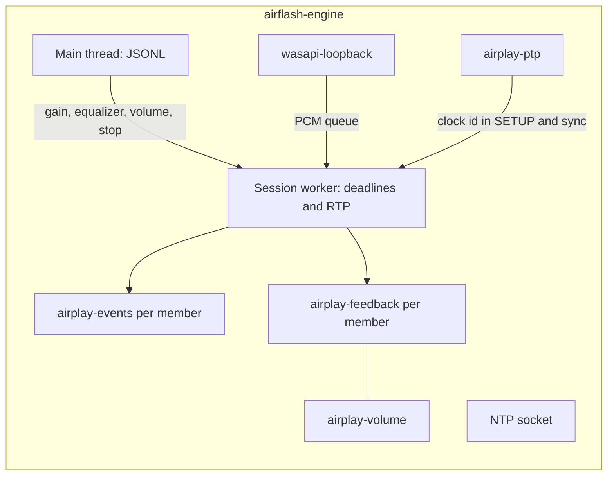

# Audio engine and the HomePod connection

`airflash-engine` is a Windows console process. Stdout is JSONL version 1 and nothing else. One worker owns the session started by `start` or `pair`. The desktop rules for opening and replacing that process are in [Session](session.md). This document follows the worker from the `start` line to teardown.

Source map:

| Area | File |
| --- | --- |
| Command loop | [`main.rs`](../../native/airflash-engine/src/main.rs) |
| Handshake and send loop | [`session.rs`](../../native/airflash-engine/src/session.rs) |
| RTSP and HAP framing | [`rtsp.rs`](../../native/airflash-engine/src/rtsp.rs) |
| Pairing | [`auth.rs`](../../native/airflash-engine/src/auth.rs) |
| Credential files | [`credentials.rs`](../../native/airflash-engine/src/credentials.rs) |
| PTP | [`clock.rs`](../../native/airflash-engine/src/clock.rs) |
| RTP | [`rtp.rs`](../../native/airflash-engine/src/rtp.rs) |
| Feedback, events, retransmit | [`transport.rs`](../../native/airflash-engine/src/transport.rs) |
| Capture | [`live.rs`](../../native/airflash-engine/src/live.rs) |
| Device volume | [`volume.rs`](../../native/airflash-engine/src/volume.rs) |

The engine validates a live `start` before spawning the worker: loopback source, unbounded duration, one or two distinct IPv4 peers, sample rate 44100 or 48000, latency 0–2000 ms, gain 0–1, and timing `ptp` or `ntp`. The desktop always sends `ptp`.

## Threads inside one playback

The main thread reads commands up to 64 KiB. `set_gain`, `set_equalizer`, and `set_device_volume` apply only when the session id matches. `stop` cancels that session and replies `stopped`. EOF cancels the worker. A second `start` or `pair` drops the running worker first.

Feedback and device volume share the control connection's mutex. A slow `GET /info` delays the next feedback write, and a feedback wait holds volume.

## Clocks started before TCP

A local `Clock` anchors Unix time to a monotonic instant. RTP sync and PTP both read it. The Windows system clock is left unchanged.

An NTP socket binds `0.0.0.0` on an ephemeral port for the life of the attempt. It is not a general NTP server. A datagram is answered only when it is 32 bytes, the source IP is one of the session peers, and byte 1 masked with `0x7f` equals `0x52`. The reply begins `0x80 0xd3`, then the request's bytes 24 through 31, then two AirPlay NTP timestamps from `Clock`. The production SETUP uses PTP, so the HomePods are not given this port. If `timing` were `ntp`, SETUP would advertise `timingPort` instead of `timingPeerInfo`. The desktop always sends `ptp`.

`PtpMaster` binds UDP 319 and 320 on every interface. If either bind fails, the attempt ends and no speaker is contacted. The clock id is random and fits in 63 bits. Every 125 ms the thread unicasts a sync and follow-up to each session peer. Every second it sends an announce. Delay requests from those peer addresses are answered. Packets from any other address are ignored.

## Per-member handshake

Members connect in the order `peers` was sent. The desktop puts the leader first. Both members later share one initial RTP timestamp. Each member draws its own sequence number and SSRC.

The control socket is non-blocking TCP with `TCP_NODELAY`. Connect budget is 3 seconds. Each request budget is 4 seconds. Windows chooses the source address. UDP audio and control bind to that same local address. The discovery NIC is not an argument to this connect.

### Info and authentication

`GET /info` is plaintext RTSP. The engine reads `deviceID`, `model`, and `sourceVersion`. The version is emitted as `peer_info` and does not select a code path.

`deviceID` selects the DPAPI file described in [Credentials and IPC](credentials-and-ipc.md). The three exchanges that follow, transient setup, persistent pairing, and pair-verify, are specified in [Authentication](auth.md). Playback uses the first or the third. The Pair button uses the second, in its own process, and does not send SETUP.

Two results follow:

*   **Saved credentials.** Pair-verify uses `X-Apple-HKP: 3`. The engine sends an X25519 public key, opens the accessory's encrypted proof, requires the accessory id to match the file, checks the Ed25519 signature, and sends its own controller proof. The control keys come from that X25519 exchange.
*   **No file.** Transient pair-setup uses `X-Apple-HKP: 4`, `POST /pair-pin-start`, and the fixed PIN `3939`. The control keys come from the SRP result. The accessory is not stored. Playback can start before the user has paired.

Either path then encrypts the control connection. The engine writes with `Control-Write-Encryption-Key` and reads with `Control-Read-Encryption-Key`, both HKDF-SHA512 from the shared secret. A bad authentication tag poisons the socket. A partial encrypted write does too, because the nonce cannot be reused.

HAP records on the wire are a 2-byte little-endian length, ciphertext, and a 16-byte tag, with at most 1024 bytes of plaintext per record. Requests use `User-Agent: AirPlay/550.10` and a rising `CSeq`. Paths under `/pair-` use HTTP. Every other request uses RTSP. The status must be 200. A buffered response with an older `CSeq` is discarded. Headers are capped at 16 KiB and bodies at 1 MiB. Chunked transfer-encoding is rejected.

### Session SETUP

The session SETUP body is a binary plist:

| Field | Value |
| --- | --- |
| `deviceID`, `macAddress` | The constant `02:57:32:41:50:01` |
| `name` | `AirFlash` |
| `sessionUUID` | A new UUID per member |
| `timingProtocol` | `PTP` |
| `isMultiSelectAirPlay` | true |
| `groupContainsGroupLeader` | false |
| `groupUUID` | Omitted. The desktop does not send `group_id` |
| `timingPeerInfo` | A new peer UUID, device type 0, the PTP clock id, and this PC's source address |

The response must include `eventPort`. A second TCP connection to that port is the event channel. It is encrypted in the opposite direction: the engine reads with the events-write key and writes with the events-read key. Its thread answers each well-formed request with `200`, the request's `CSeq`, and `Audio-Latency: 0`. The body is not interpreted. Closure or a malformed request fails the member.

`SETPEERS` then sends every peer address plus the local address. It is sent when a PTP clock id exists, which is the production path.

### Audio SETUP

One stream is offered:

| Field | Value |
| --- | --- |
| Codec | PCM when `cn` is empty or contains `0`. ALAC when `0` is absent and `1` is present. Any other list fails the member |
| `ct` | 1 for PCM, 2 for ALAC |
| `audioFormat` | Bit 11 or 15 for PCM at 44100 or 48000. Bit 18 or 20 for ALAC |
| `spf` | 352 frames |
| `sr` | The stream rate |
| `shk` | The events-write key. The local packetizer uses the same key |
| `latencyMin`, `latencyMax` | Requested latency converted to samples |
| `controlPort` | The local UDP port bound for retransmits and sync |
| `type` | 96 |
| `streamConnectionID` | This member's SSRC |

The response must include `dataPort` and `controlPort`. Audio UDP connects to `dataPort`. If the returned `latencyMin` is greater than zero and at most ten seconds of audio, that duration becomes this member's playout offset. Otherwise the requested latency remains. Sync packets, below, still carry the requested latency in samples.

The engine emits `negotiated` with the data port, codec, rate, control port, and the receiver latency figure. `measured_latency_ms` in that event is null. The product does not report an acoustic measurement.

## Record, then capture

`RECORD` is sent only after every member has finished both SETUP calls. The headers are `Range: npt=0-` and `RTP-Info` with the current sequence and RTP timestamp. `FLUSH` repeats those headers. Feedback starts, and the volume worker starts.

WASAPI loopback then starts on `wasapi-loopback` at Pro Audio priority. The capture endpoint id is matched by device id or friendly name. An empty id selects the default console render endpoint. The client uses shared mode, loopback, and an event callback, preferring the device's shared engine period and falling back to a 20 ms buffer (`200_000` in 100-nanosecond units). Accepted mix formats are float32 and 16-, 24-, or 32-bit integer, 1–8 channels, 8–192 kHz. Channels past the second are ignored. One channel is duplicated to stereo.

Input is resampled to the stream rate with a 64-tap Blackman-Harris sinc in chunks of one hundredth of a second. A ratio trim of at most ±0.05 percent pulls the queue back toward 20 ms. The queue holds at most 60 ms. Frames dropped from the head increment `dropped_frames`. A discontinuity flag clears the resampler. If the render endpoint delivers no packet for two seconds, the capture thread probes `GetNextPacketSize` and treats a failure as a disconnected endpoint.

The media thread waits up to 200 ms for the 20 ms fill, then emits `streaming`. That event is the desktop's cue to publish Playing and, by default, mute the local endpoint.

## The send loop

The schedule starts at `streaming` and advances 352 frames per packet. At 44100 Hz that is about 8 ms. At 48000 Hz it is about 7.3 ms. The thread sleeps in slices of at most 2 ms until the deadline. The sleep is `std::thread::sleep`. The process does not call `timeBeginPeriod`. The capture thread and this media thread each request the MMCSS "Pro Audio" profile. The deadline is this monotonic schedule. PTP does not pace the sender.

The capture queue is a `Mutex<VecDeque>`, not a lock-free ring. Its capacity, the underrun counter, and the three clocks (capture QPC, this schedule, and the PTP `Clock`) are specified in [Capture and clocks](capture-clocks.md). The shared RTSP lock is specified in [Control and mute](control-and-mute.md).

Each iteration:

1. Drains volume events and per-member health notices. A stored failure aborts the loop.
2. If the thread is more than 60 ms late, counts the missed slots, advances every member's sequence and RTP timestamp without reusing a nonce, trims the capture queue back to 20 ms, and emits `sender_late_recovered`. A finite probe aborts instead of skipping. A live stream continues.
3. Every 100 ms, sends an RTP sync packet on each control socket. The packet maps the current RTP timestamp to `Clock` time and includes the PTP clock id. The payload type is `0xd7` when a clock id exists. The second RTP field is the timestamp minus the requested latency in samples. The first sync packet sets the extension bit. The receiver applies `latencyMin` itself. The packetizer does not shift timestamps a second time.
4. Pulls 352 stereo frames. An empty queue becomes silence and increments `underrun_packets`. Samples louder than about −48 dBFS update `last_audio_qpc_ns`, which the desktop uses for standby. The equalizer runs here, then master gain. The same PCM is encrypted and sent to every member before any retransmission is served.
5. Services retransmit requests for up to 1 ms, at most 16 requests and 32 resends.

RTP audio is a 12-byte header, ciphertext, and an 8-byte little-endian nonce. The first header byte is `0x80`. The second is `0x60`, or `0xe0` on the first packet of the member, which is the marker bit plus payload type `0x60`. Sequence, timestamp, and SSRC follow, big-endian. PCM is encrypted as 16-bit big-endian samples. ALAC swaps each sample to little-endian, encodes, then encrypts. The additional data is the four timestamp bytes and the four SSRC bytes. A skipped slot advances sequence and timestamp and does not consume a nonce. History keeps 512 packets, for at least one second and at least the playout latency plus 250 ms. A retransmit reply is `0x80 0xd6`, the requested sequence, then the cached packet. The request is 8 bytes with payload `0x55`.

Authentication before this header exists is specified in [Authentication](auth.md). Every way the session ends is in [Failures](failures.md).

A retransmit request is 8 bytes, payload `0x55`, from the member's address. The reply is payload `0xd6` on the control socket. Unknown or expired sequence numbers are counted and dropped. The pending queue holds at most 512 packets.

One failed audio `send` increments `media_send_errors` and raises `media_send_delayed` once. The member fails with `media_send_timeout` only after 12 seconds without a successful send. The next success clears the warning.

Capture metrics and transport metrics are emitted about once a second. Those lines are what keep the desktop's 15-second read timeout satisfied during healthy playback.

### Equalizer and the two volumes

Equalizer settings crossfade over `sample_rate / 50` frames, which is 20 ms. The bands, the Q of 1.4, the headroom grid, and the 50 ms preview are in [Equalizer](equalizer.md). `set_equalizer` prepares the new coefficients on the command thread and the capture path picks them up by sequence. Invalid gains are rejected with `equalizer_error` and playback continues. Finite probes reject an enabled equalizer. Both stereo members hear the same processed PCM.

Master volume is this PCM gain, stored as an atomic float and applied when the packet is built.

Device volume is receiver state. The volume thread, ordered with the leader first, sends `SET_PARAMETER` with `volume: {dB}` to every member when the sequence changes. The mapping is `percent * 0.3 - 30` for 1–100, and −144 dB for 0. About once a second it reads `initialVolume` from `GET /info` on each member. The event's top-level host and volume are the leader's. Status is `confirmed` when every member reports the requested percent, `pending` for up to 3 seconds, `unconfirmed` after that, or `unsynced` when a read fails. The desktop shows the leader.

## Watches that end the member

| Watch | Interval | Warning | Failure |
| --- | --- | --- | --- |
| `POST /feedback` | Every 2 seconds | Reply later than 4 seconds: `feedback_delayed`. Audio continues | No reply by 12 seconds. Or three responses in 500–504. Or 401/403 as authentication. Or 454 as a retryable session rejection. Any other status is `session_rejected` |
| Event TCP | Continuous read, 20 ms poll |  | Any read or parse error fails the member on channel `events` |
| Audio UDP | Every packet | First failed send | 12 seconds with no successful send |
| Scheduler | Every packet | `sender_late_recovered` after a skip | A live stream does not fail this way |

Feedback success resets the delayed flag and emits `feedback_recovered`. Health stores at most 16 warnings. The media thread copies them to stdout and calls `check`. The first stored fault becomes the attempt's `error` event.

Faults map to the desktop retry flag as follows. The desktop applies this flag only when force reconnect is on. See [Session](session.md).

| Condition | Code | Retryable |
| --- | --- | --- |
| Session cancelled | `cancelled` | false |
| Peer closed the control socket | `peer_closed` | true |
| Control read timed out | `read_timeout` | true |
| Control write failed or the cipher state was poisoned | `write_failed` | true |
| Authentication tag mismatch, pair-verify failure, SRP failure | `authentication_failed` | false |
| Connection reset | `connection_reset` | true |
| Other socket error | `socket_error` | true |
| Unclassified protocol failure | `protocol_error` | false |
| Feedback passed 12 seconds | `feedback_timeout` | true |
| Feedback 401 or 403 | `authentication_failed` | false |
| Feedback status 454 | `session_rejected` | true |
| Other feedback rejection | `session_rejected` | false |
| Media silent for 12 seconds | `media_send_timeout` | true |

## Teardown

`Member::close` runs on drop and at the end of the send loop. It stops that member's feedback thread, sends `TEARDOWN` when SETUP had started a session, then stops the event thread. `TEARDOWN` uses a 300 ms budget and temporarily clears the cancellation flag so a user stop can still deliver it. The TCP socket is shut down in both directions when the connection drops.

The worker then emits a final metrics line and `stopped`. The desktop's `stop` command, stdin close, and two-second kill are the outer bound. See [Session](session.md).

## Persistent pairing

The `pair` command is a different worker. It connects, reads `/info`, and runs pair-setup with `X-Apple-HKP: 3`. After the SRP exchange it emits `pin_required` and waits up to 120 seconds on an internal channel for `pair_pin`. The PIN must be 4–8 digits. The engine then exchanges Ed25519 identity proofs, checks the accessory signature, and writes the DPAPI file under `deviceID`. This connection does not enable the playback cipher and does not send SETUP. The following `start` loads the file and uses pair-verify.

A stereo pair completes this once per member. The playback that follows is one process and two peers.

## What one pair shares

Both speakers receive the same samples from one capture queue. They share the PTP clock id and the initial RTP timestamp. Each has its own session UUID, SSRC, sequence, encryption keys, control connection, event connection, feedback loop, and UDP ports. There is no `groupUUID` and the sender does not claim to be the group leader. The leader is ordered first so the volume event names that host. `SET_PARAMETER` is still sent to both.

A failure of either member's feedback, event socket, or media send ends the worker. The other member is torn down with it.
