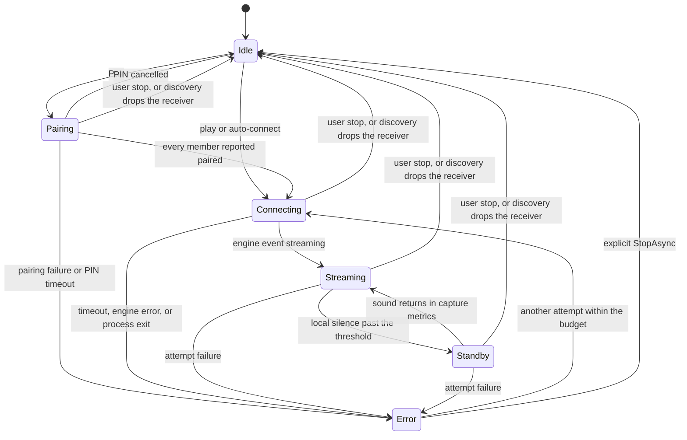

# Session control

[`SessionController`](../../desktop/AirFlash.Core/SessionController.cs) is the desktop owner of a playback attempt. [`AppViewModel`](../../desktop/AirFlash.App/ViewModels/AppViewModel.cs) decides when to call it. The Rust process it opens is described in [Engine](engine.md). This document covers the state machine, the process boundary, and the rules that replace or keep that process.

## Doors into the controller

| Call | Who uses it | Engine command |
| --- | --- | --- |
| `StartAsync` | Play and auto-connect | One `start` for the whole receiver |
| `PairAsync` | Settings → Pair | One `pair` per member, then the same `start` |
| `StopAsync` | Stop, or discovery reporting the receiver gone or incomplete | `stop`, then process exit |
| `UpdateReceiverAsync` | A discovery result changed the playing row | Restart only for an active non-pairing session with changed signature; otherwise update its receiver/settings |
| `UpdateSettingsAsync` | Apply, or the debounced master-volume save | Restart only for an active non-pairing session with changed signature; otherwise attempt gain/equalizer updates and the mute-setting change |

An incomplete stereo row throws from `StartAsync` and `PairAsync` before a process is created. A click on an address that belongs to a pair is rewritten to that pair first.

The `_serial` semaphore serializes lifecycle/settings/gain calls; equalizer sends have a separate `_equalizerWriter`, and every pipe write uses the connection's writer semaphore. `StartAsync` cancels the current attempt and waits until its task finishes, including connection disposal and process exit. A new play pressed while a failure is still disposing waits for that dispose. `StopLockedAsync` advances the generation before cancellation; `StartLockedAsync` advances it again for the replacement. A stale generation cannot publish over the new snapshot ([SessionController.cs:175–260](../../desktop/AirFlash.Core/SessionController.cs#L175), [EngineConnection.cs:34–42](../../desktop/AirFlash.Core/EngineConnection.cs#L34)).

## States



The snapshot exposed to the panel carries the state, the receiver, a message, capture metrics, target latency, diagnostics, stream rate, and device-volume state. The panel title is Connecting, Playing, Standby, Pairing, Connection error, or Ready. Exhausting the retry budget leaves Error; it does not transition to Idle ([SessionController.cs:373–394](../../desktop/AirFlash.Core/SessionController.cs#L373)).

Playback and pairing run inside `Task.Run`; hostname resolution runs there asynchronously, while RTSP and capture execute in the native process. UI handlers still await controller start/stop/settings tasks, including asynchronous process cleanup; these awaits do not mean socket or audio callbacks execute on the dispatcher. The literal statement "the UI thread never awaits DNS/RTSP" is less precise than "the UI does not synchronously perform those network/capture operations" ([SessionController.cs:199–209,289–291,455–459](../../desktop/AirFlash.Core/SessionController.cs#L199), [AppViewModel.cs:292–315](../../desktop/AirFlash.App/ViewModels/AppViewModel.cs#L292)).

`IsActive` is connecting, streaming, standby, or pairing. Auto-connect refuses to start while any of those is current. An error state is inactive, so a later offline-to-online cycle can auto-connect again.

## The process

[`ProcessEngineConnection`](../../desktop/AirFlash.Core/EngineConnection.cs) starts `airflash-engine.exe` with stdin, stdout, and stderr piped, and with no window. Each command line is one JSON object, version 1. The engine enforces a 65,536-byte input limit including the newline; native output has no corresponding size guard. The desktop checks stdout lines against 65,536 UTF-16 characters after `ReadLineAsync` has allocated the complete line, and does not size-check outgoing commands. These are different limits, not a symmetric 64 KiB guarantee ([EngineConnection.cs:34–51](../../desktop/AirFlash.Core/EngineConnection.cs#L34), [main.rs:22–34,54–110](../../native/airflash-engine/src/main.rs#L22)).

The desktop generates a request id per command and a session id per playback attempt or pairing process. Worker events retain the id of the initiating `start`/`pair`; command replies use that command's id. The session reader filters on version and session id, not request id. Malformed input and oversized-command errors carry empty ids and are therefore ignored by that reader until a matching event or the timeout ([SessionController.cs:441–454](../../desktop/AirFlash.Core/SessionController.cs#L441)).

Stderr is copied to the WPF log. It is not a control channel.

On dispose the desktop closes stdin, waits two seconds, and requests a process-tree kill if the process is still running, then awaits exit and stderr drainage. This is a timeout before forced termination, not a hard two-second completion guarantee. Cleanup first sends `stop` with a one-second send budget; it does not wait for a `stopped` acknowledgement. Expected delivery failures are ignored because stdin closure also cancels and joins the worker ([EngineConnection.cs:48–59](../../desktop/AirFlash.Core/EngineConnection.cs#L48), [SessionController.cs:435–439](../../desktop/AirFlash.Core/SessionController.cs#L435)).

The engine accepts one worker at a time. A worker failure emits `error` and leaves the command loop alive; `stop` removes and joins the worker but also leaves that loop alive. EOF ends the loop/process. The desktop uses a fresh process for each attempt, so a retry never shares RTSP sockets with the attempt it replaced ([main.rs:36–52,157–172,324–340](../../native/airflash-engine/src/main.rs#L36)).

### Play command

Before `start`, each member address is resolved to IPv4. A literal IPv4 address is kept. A hostname is resolved and the first IPv4 answer is used. Members are ordered leader first. The command body is:

```json
{
  "peers": [{ "host": "192.0.2.10", "port": 7000, "codecs": [0, 1] }],
  "source": "loopback",
  "duration_ms": 0,
  "latency_ms": 200,
  "gain": 0.4,
  "timing": "ptp",
  "capture_endpoint": null,
  "sample_rate": 44100,
  "equalizer": { "enabled": false, "preamp_db": 0, "band_gains_db": [0, 0, 0, 0, 0, 0, 0, 0, 0, 0] }
}
```

`gain` is master volume divided by 100, or `0` while the panel mute is on. `capture_endpoint` is null for default loopback and the endpoint id when capture mode is `endpoint`. `latency_ms` comes from the receiver override or the global mode: realtime 120, normal 200, buffered 500, custom clamped to 0–2000. The default mode is normal.

The desktop then reads events until the attempt ends.

| Event | While connecting | After `streaming` |
| --- | --- | --- |
| `streaming` | Mute the local endpoint when mute-while-streaming is on. Publish Streaming. The connect budget ends | The same handler runs again, resets the uptime anchor, and publishes Streaming; the engine normally emits it once |
| `error` | Fail the attempt with the engine's code, host, channel, and retryable flag | Same |
| `stopped` | Fail as an unexpected end | Same |
| `capture_metrics` | Recorded only after `streaming` | Update metrics. Maybe switch Standby |
| `transport_metrics` | Same | Replace the live transport block |
| `warning` | Same | Store or clear one warning per `host:channel` |
| `device_volume` | Accepted after `streaming` when `host` is the leader | Update the slider |
| `equalizer_changed` or `equalizer_error` | Deliver to the settings editor when the sequence matches | Same |

The connect deadline is set to 40 seconds immediately before the `start` send; IPv4 resolution and process creation precede it. It bounds subsequent event reads, not the entire send/initialization operation. After `streaming`, each matching-event read waits 15 seconds. A read timeout is "The audio engine response timed out." If the connect deadline is already past before the next read, the message is "Timed out connecting to the audio device." Every accepted matching event, including an otherwise ignored event, resets the post-stream read wait ([SessionController.cs:286–330,441–454](../../desktop/AirFlash.Core/SessionController.cs#L286)).

### Pairing command

Pairing uses a separate process per member, leader first. The desktop sends `pair` with that member's resolved host and port, then gives each event read a fresh 40-second budget. There is no aggregate 40-second pairing deadline. Waiting for the PIN happens outside the event-read budget ([SessionController.cs:396–427](../../desktop/AirFlash.Core/SessionController.cs#L396)).

- `pin_required` opens the PIN dialog after the accessory's setup M2 response, before the client's SRP proof exchange. The desktop cancels the dialog after 120 seconds; the engine waits up to 120 seconds independently, with 100 ms cancellation polls. Expiring the desktop PIN token raises cancellation in `PinDialog`, which is not the same path as a blank/cancelled dialog result and can publish Error ([auth.rs:111–127](../../native/airflash-engine/src/auth.rs#L111), [main.rs:272–291](../../native/airflash-engine/src/main.rs#L272), [PinDialog.cs:28–38](../../desktop/AirFlash.App/Ui/PinDialog.cs#L28)).
- A blank PIN publishes "Pairing cancelled." and throws. `start` is not sent.
- A PIN is sent as `pair_pin`. The engine requires 4–8 digits with no other characters. The dialog's dash rule is in [Authentication](auth.md).
- `paired` advances to the next member.
- `error` fails the attempt.

After the last member, those processes are stopped and one playback process runs `start` for the whole receiver. A stereo pair is two pairing processes, then one playback process whose `peers` array has length two. The credential file is written by the engine under the accessory `deviceID` from `GET /info`, not under the catalog id. See [Engine](engine.md).

## Local behavior around the stream

Mute-while-streaming defaults on. Mute is applied when `streaming` arrives and restore is requested after failure, stop, disposal, or turning the setting off. Stop/failure restoration follows attempt cleanup, including the stop send and process disposal; it is not guaranteed immediate. Restoration is best-effort and logged on failure. [`AudioService`](../../desktop/AirFlash.App/Services/AudioService.cs) saves the endpoint's prior mute bit when it first applies mute and restores that exact bit. Successful restoration returns sound to a previously unmuted endpoint if audio is still playing. Discovery stops use this path ([SessionController.cs:218–224,370–375,461–463](../../desktop/AirFlash.Core/SessionController.cs#L218)). See [Control and mute](control-and-mute.md).

A stop from the UI or from a missing discovery row cancels `_lifetime`. `RunStreamAsync` treats that cancellation as a return, before the reconnect counter increments. The next play or auto-connect calls `StartLockedAsync`, which replaces diagnostics with an empty object. The monitor then shows zero reconnects for that new playback. See [Playback coupling](playback-coupling.md).

Standby defaults off. When it is on, `capture_metrics` computes silence from `last_audio_qpc_ns`, or from time since `streaming` when that field is missing. The threshold is the per-receiver standby seconds or the global value, default 10, allowed 5–300. Crossing it publishes Standby. The engine process keeps running. A later metric under the threshold publishes Streaming again.

Device volume is sent only while Streaming or Standby, after the engine has reported it available. The desktop waits 200 ms after the latest edit, sends `set_device_volume` with a rising sequence, then marks it unconfirmed if its target remains pending three seconds after the send. A matching reading with status `pending` does not settle the edit; a matching non-pending status clears the target. A reconnect clears volume state and pending edits ([SessionController.cs:115–161](../../desktop/AirFlash.Core/SessionController.cs#L115), [DeviceVolumeState.cs:11–29](../../desktop/AirFlash.Core/DeviceVolumeState.cs#L11)).

Equalizer preview uses `set_equalizer` with a rising sequence. The desktop coalesces edits to about one send per 50 ms. An I/O failure is logged and surfaced to the editor. It does not end playback. The sequence must match the latest edit, so a stale reply is ignored. The filter and the headroom math are in [Equalizer](equalizer.md).

Master volume is debounced 200 ms and saved with the rest of settings, then applied with `set_gain` when the signature is unchanged. Tests lock this in: changing the capture endpoint or latency opens a second process; changing master volume does not.

The full matrix of endings, including this loop, discovery stops, and engine faults, is in [Failures](failures.md).

## Replacing the process

`ForceReconnect` defaults off. The first failure publishes Error, restores local mute, and returns. The diagnostics keep `LastFault`, the capture metrics from before the fault, and the transport metrics from before the fault.

With force reconnect on, the loop continues while all of these hold:

- The structured retryable flag permits retry. Protocol/cryptographic authentication failures are generally false; network errors during authentication may remain true. Only when the flag is absent does the desktop keyword scan treat pairing, SRP, verification, credentials, signature, identity, or authentication as final. An explicit true takes precedence over message text.
- The attempt count is at or below `MaxReconnectAttempts`.
- The user has not cancelled the attempt.

If `streaming` had been active for at least 10 seconds, the attempt count is reset before it increments. A long session receives a fresh budget. The wait is 1 second doubled on each attempt, capped at 8 seconds. During the wait the message is "Disconnected; reconnecting ({n}/{max})". `ReconnectCount` increments when the next attempt begins.

Each retry opens a new process and a new session id. RTP does not continue. At creation of that process, live capture/transport fields and warnings are cleared. The saved fault and pre-fault metrics remain even after successful `streaming` and new live metrics. A further failure replaces `LastFault` and preserves the last available pre-fault metrics. Any `StartLockedAsync` call, including an explicit start or a settings/discovery restart, clears that history ([SessionController.cs:190–195,300–301,325–329,379–384](../../desktop/AirFlash.Core/SessionController.cs#L190)).

Discovery can replace or end the process without entering this loop:

- The receiver disappears, or a stereo row no longer has exactly two members (including more than two): `StopAsync` for an active non-manual session, including Connecting/Pairing. A later auto-connect creates a new session with `ReconnectCount` zero.
- Address, port, or stereo-member leader flag changes: `UpdateReceiverAsync` invokes `StartLockedAsync` because the transport signature changed. A standalone receiver's leader flag is excluded. Member ordering, names, codecs, and ids are not part of `TransportKey`; a codec-only announcement change does not restart an existing process ([Receiver.cs:20](../../desktop/AirFlash.Core/Receiver.cs#L20)).
- Capture endpoint, latency, or sample rate changes: `UpdateSettingsAsync` does the same.
- Identity promotion with the same full signature updates the receiver object without opening a process. The same address alone is insufficient: migrated per-receiver latency can change the signature and restart. Existing tests cover both outcomes ([SessionTests.cs:91–112](../../desktop/AirFlash.Tests/SessionTests.cs#L91)).

The default audio endpoint changing while capture mode is loopback also calls `StartAsync` for the current receiver. That path is endpoint notification, not discovery.

## What the user sees in diagnostics

The monitor responds to published snapshots. Metrics normally arrive about once a second; warnings and volume events also publish updates. The dispatcher drops a queued snapshot if it is no longer the controller's current snapshot, and refreshes monitor values only while visible ([AppViewModel.cs:247–287](../../desktop/AirFlash.App/ViewModels/AppViewModel.cs#L247)). It shows capture latency, queue age, underruns, drops, rates, sender recoveries, skipped packets, reconnect count, session uptime, warnings, the last fault, and saved pre-fault metrics. Per-member rows show packets, send errors, retransmits, feedback, and adopted latency. Native session counters start fresh in a new worker and appear as its metric events arrive. `ReconnectCount` belongs to the desktop playback loop and persists across its retries.

## Source verification and coverage

Verified against runtime source corresponding to upstream `41190e0`, in the `c077a05` documentation baseline. This is a source/test audit; it does not establish real-device reliability or acoustic timing.

| Claims | Exact evidence and existing tests |
| --- | --- |
| Nonblocking start, serialized switching, stale-event protection | [SessionController.cs:176–224,441–474](../../desktop/AirFlash.Core/SessionController.cs#L176); [SessionTests.cs:126–174](../../desktop/AirFlash.Tests/SessionTests.cs#L126), `StartIsNonblockingAndStopCancelsPendingConnection`, `SwitchingWaitsForPreviousCleanupAndRejectsStaleEvents`, `SwitchDuringFailureWaitsForDispose`, `ReconnectCleansOldProcessAndUsesFreshSession` |
| Restart signature, gain, identity promotion, standby | [SessionController.cs:175,226–275,360–366](../../desktop/AirFlash.Core/SessionController.cs#L175); [SessionTests.cs:91–124](../../desktop/AirFlash.Tests/SessionTests.cs#L91), [142–150](../../desktop/AirFlash.Tests/SessionTests.cs#L142), [190–223](../../desktop/AirFlash.Tests/SessionTests.cs#L190) |
| Retry, fault retention, structured retry flag | [SessionController.cs:277–394](../../desktop/AirFlash.Core/SessionController.cs#L277); [SessionTests.cs:177–187](../../desktop/AirFlash.Tests/SessionTests.cs#L177), [260–302](../../desktop/AirFlash.Tests/SessionTests.cs#L260) |
| Pairing cancellation and two-member pairing | [SessionController.cs:396–429](../../desktop/AirFlash.Core/SessionController.cs#L396); [SessionTests.cs:226–238](../../desktop/AirFlash.Tests/SessionTests.cs#L226) |
| Equalizer and device-volume coalescing, nonfatal responses | [SessionController.cs:38–163,320–340](../../desktop/AirFlash.Core/SessionController.cs#L38); [SessionTests.cs:16–88](../../desktop/AirFlash.Tests/SessionTests.cs#L16), [309–358](../../desktop/AirFlash.Tests/SessionTests.cs#L309) |
| Defaults/ranges, UI coupling and default-endpoint restart | [Settings.cs:33–99](../../desktop/AirFlash.Core/Settings.cs#L33); [AppViewModel.cs:135–220,292–323,396–415](../../desktop/AirFlash.App/ViewModels/AppViewModel.cs#L135); details in [Playback coupling](playback-coupling.md) |

These desktop tests use fake engine/audio connections. They verify controller semantics, not actual OS mute restoration, WASAPI, DNS latency, RTSP, or HomePod behavior. No network probes were performed as part of this documentation audit.
