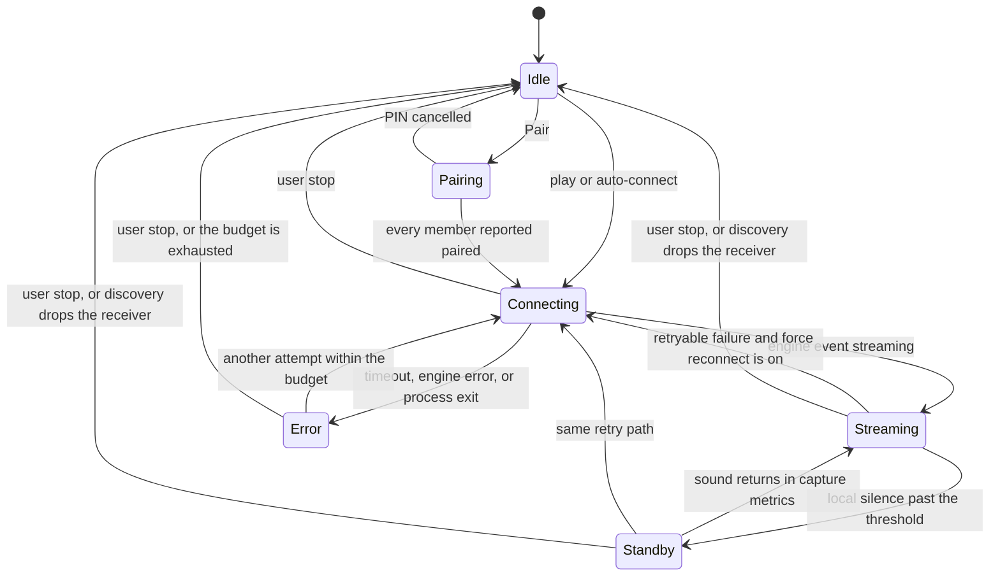

# Session control

[`SessionController`](../../desktop/AirFlash.Core/SessionController.cs) is the desktop owner of a playback attempt. [`AppViewModel`](../../desktop/AirFlash.App/ViewModels/AppViewModel.cs) decides when to call it. The Rust process it opens is described in [Engine](engine.md). This document covers the state machine, the process boundary, and the rules that replace or keep that process.

## Doors into the controller

| Call | Who uses it | Engine command |
| --- | --- | --- |
| `StartAsync` | Play and auto-connect | One `start` for the whole receiver |
| `PairAsync` | Settings → Pair | One `pair` per member, then the same `start` |
| `StopAsync` | Stop, or discovery reporting the receiver gone or incomplete | `stop`, then process exit |
| `UpdateReceiverAsync` | A discovery result changed the playing row | `start` again only when the transport signature changed |
| `UpdateSettingsAsync` | Apply, or the debounced master-volume save | `start` again when the signature changed. Otherwise `set_gain` and `set_equalizer` |

An incomplete stereo row throws from `StartAsync` and `PairAsync` before a process is created. A click on an address that belongs to a pair is rewritten to that pair first.

One lock serializes these calls. `StartAsync` cancels the current attempt and waits until its task finishes, which includes process exit. A new play pressed while a failure is still disposing waits for that dispose. The generation counter then advances. Events stamped with the old generation cannot publish over the new snapshot.

## States



The snapshot exposed to the panel carries the state, the receiver, a message, capture metrics, target latency, diagnostics, stream rate, and device-volume state. The panel title is Connecting, Playing, Standby, Pairing, Connection error, or Ready.

`IsActive` is connecting, streaming, standby, or pairing. Auto-connect refuses to start while any of those is current. An error state is inactive, so a later offline-to-online cycle can auto-connect again.

## The process

[`ProcessEngineConnection`](../../desktop/AirFlash.Core/EngineConnection.cs) starts `airflash-engine.exe` with stdin, stdout, and stderr piped, and with no window. Each line is one JSON object, version 1, at most 64 KiB. The desktop generates a new request id and a new session id per attempt. The engine echoes them on every event. The reader ignores lines for a different session id or a different version.

Stderr is copied to the WPF log. It is not a control channel.

On dispose the desktop closes stdin, waits two seconds, and kills the process tree if it is still running. `Stop` also sends a `stop` command with a one-second budget. A failure to deliver `stop` is ignored because closing stdin cancels the worker.

The engine accepts one running session. The desktop still uses a fresh process for each attempt, so a retry never shares RTSP sockets with the attempt it replaced.

### Play command

Before `start`, each member address is resolved to IPv4. A literal IPv4 address is kept. A hostname is resolved and the first IPv4 answer is used. Members are ordered leader first. The command body is:

```json
{
  "peers": [{ "host": "192.0.2.10", "port": 7000, "codecs": [0, 1] }],
  "source": "loopback",
  "duration_ms": 0,
  "latency_ms": 200,
  "gain": 0.4,
  "timing": "ptp",
  "capture_endpoint": null,
  "sample_rate": 44100,
  "equalizer": { "enabled": false, "preamp_db": 0, "band_gains_db": [] }
}
```

`gain` is master volume divided by 100, or `0` while the panel mute is on. `capture_endpoint` is null for default loopback and the endpoint id when capture mode is `endpoint`. `latency_ms` comes from the receiver override or the global mode: realtime 120, normal 200, buffered 500, custom clamped to 0–2000. The default mode is normal.

The desktop then reads events until the attempt ends.

| Event | While connecting | After `streaming` |
| --- | --- | --- |
| `streaming` | Mute the local endpoint when mute-while-streaming is on. Publish Streaming. The connect budget ends | Ignored as a state change |
| `error` | Fail the attempt with the engine's code, host, channel, and retryable flag | Same |
| `stopped` | Fail as an unexpected end | Same |
| `capture_metrics` | Recorded only after `streaming` | Update metrics. Maybe switch Standby |
| `transport_metrics` | Same | Replace the live transport block |
| `warning` | Same | Store or clear one warning per `host:channel` |
| `device_volume` | Accepted after `streaming` when `host` is the leader | Update the slider |
| `equalizer_changed` or `equalizer_error` | Deliver to the settings editor when the sequence matches | Same |

The connect budget is 40 seconds from `start` until `streaming`. After that, each read waits 15 seconds. A gap longer than that is "The audio engine response timed out." Those budgets are [`SessionTiming.Default`](../../desktop/AirFlash.Core/SessionController.cs).

### Pairing command

Pairing uses a separate process per member, leader first. The desktop sends `pair` with that member's host and port, then waits for events inside the 40-second connect budget.

- `pin_required` opens the PIN dialog. The desktop also cancels the dialog after 120 seconds. The engine applies the same 120-second limit internally.
- A blank PIN publishes "Pairing cancelled." and throws. `start` is not sent.
- A PIN is sent as `pair_pin`. The engine requires 4–8 digits with no other characters. The dialog's dash rule is in [Authentication](auth.md).
- `paired` advances to the next member.
- `error` fails the attempt.

After the last member, those processes are stopped and one playback process runs `start` for the whole receiver. A stereo pair is two pairing processes, then one playback process whose `peers` array has length two. The credential file is written by the engine under the accessory `deviceID` from `GET /info`, not under the catalog id. See [Engine](engine.md).

## Local behavior around the stream

Mute-while-streaming defaults on. Mute is applied when `streaming` arrives, and restored when the attempt fails, when the user stops, when the setting is turned off, or when the controller is disposed. Restoring mute is best-effort and logged on failure. [`AudioService`](../../desktop/AirFlash.App/Services/AudioService.cs) remembers the endpoint's previous mute bit and writes `true`. Restore writes that saved bit back. A stop while system audio is still playing returns sound to the PC endpoint that was unmuted before the stream. Discovery-triggered stops take this same path. The sequence is in [Control and mute](control-and-mute.md).

A stop from the UI or from a missing discovery row cancels `_lifetime`. `RunStreamAsync` treats that cancellation as a return, before the reconnect counter increments. The next play or auto-connect calls `StartLockedAsync`, which replaces diagnostics with an empty object. The monitor then shows zero reconnects for that new playback. See [Playback coupling](playback-coupling.md).

Standby defaults off. When it is on, `capture_metrics` computes silence from `last_audio_qpc_ns`, or from time since `streaming` when that field is missing. The threshold is the per-receiver standby seconds or the global value, default 10, allowed 5–300. Crossing it publishes Standby. The engine process keeps running. A later metric under the threshold publishes Streaming again.

Device volume is sent only while Streaming or Standby, and only when the engine has already reported the control as available. The desktop waits 200 ms after the last slider edit, sends `set_device_volume` with a rising sequence, and marks the edit unconfirmed if no matching reading arrives within 3 seconds. A reconnect clears the volume state and any pending edit.

Equalizer preview uses `set_equalizer` with a rising sequence. The desktop coalesces edits to about one send per 50 ms. An I/O failure is logged and surfaced to the editor. It does not end playback. The sequence must match the latest edit, so a stale reply is ignored. The filter and the headroom math are in [Equalizer](equalizer.md).

Master volume is debounced 200 ms and saved with the rest of settings, then applied with `set_gain` when the signature is unchanged. Tests lock this in: changing the capture endpoint or latency opens a second process; changing master volume does not.

The full matrix of endings, including this loop, discovery stops, and engine faults, is in [Failures](failures.md).

## Replacing the process

`ForceReconnect` defaults off. The first failure publishes Error, restores local mute, and returns. The diagnostics keep `LastFault`, the capture metrics from before the fault, and the transport metrics from before the fault.

With force reconnect on, the loop continues while all of these hold:

- The failure is retryable. The engine sets `retryable: false` for authentication and for protocol errors it will not recover. A desktop exception whose message contains pairing, SRP, verification, credentials, signature, identity, or authentication is also final.
- The attempt count is at or below `MaxReconnectAttempts`.
- The user has not cancelled the attempt.

If `streaming` had been active for at least 10 seconds, the attempt count is reset before it increments. A long session receives a fresh budget. The wait is 1 second doubled on each attempt, capped at 8 seconds. During the wait the message is "Disconnected; reconnecting ({n}/{max})". `ReconnectCount` increments when the next attempt begins.

Each retry opens a new process and a new session id. RTP does not continue. Until the new attempt reaches `streaming`, the panel keeps the previous fault and the metrics from before it, and the live metric fields are empty. A user-initiated `StartAsync` clears that history.

Discovery can replace or end the process without entering this loop:

- The receiver disappears, or a pair drops below two members: `StopAsync`. A later auto-connect is a new session and leaves `ReconnectCount` at zero.
- Address, port, or leader flag changes: `UpdateReceiverAsync` calls `StartAsync` because the transport signature changed.
- Capture endpoint, latency, or sample rate changes: `UpdateSettingsAsync` does the same.
- Identity promotion with the same address updates the receiver object and does not open a process. The regression check is "identity promotion updates an active stream without reconnecting."

The default audio endpoint changing while capture mode is loopback also calls `StartAsync` for the current receiver. That path is endpoint notification, not discovery.

## What the user sees in diagnostics

The monitor reads the current snapshot about once a second of engine output, coalesced by the UI. It shows capture latency, queue age, underruns, drops, rates, sender recoveries, skipped packets, reconnect count, session uptime, warnings, the last fault, and the metrics saved from before that fault. Per-member rows show packets, send errors, retransmits, feedback, and the latency figure the engine adopted. Those numbers are session counters. They reset when a new process reaches `streaming`.
