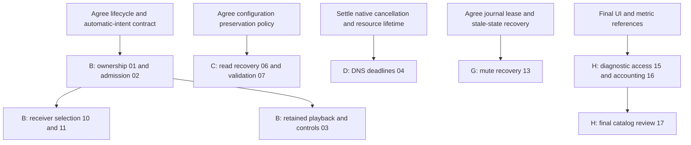

# AirFlash implementation plan

This plan covers all **17 current reports in eight coherent PR groups**. Its original work packages described future implementation. Subsequent execution is recorded separately in [Group B feature acceptance](GROUP-B-ACCEPTANCE.md): reports 01, 02, 03, 10 and 11 are implemented and tested on an original-base feature branch. Group A and then Group B are integrated into local fork `main` at `72dc7c7`; [combined fork validation](FORK-INTEGRATION-ACCEPTANCE.md) records later build/download evidence. Original upstream stable main is unchanged. Issue numbers organize the backlog by severity; they are not the execution order.

Task 3 publication on 2026-10-07 followed the user's explicit order: separate scrolling [issue #12](https://github.com/Ding-Kyoma/AirFlash/issues/12) / [PR #13](https://github.com/Ding-Kyoma/AirFlash/pull/13), then Group B [issue #14](https://github.com/Ding-Kyoma/AirFlash/issues/14) / [PR #15](https://github.com/Ding-Kyoma/AirFlash/pull/15). Both remain unmerged and awaited maintainer workflow approval at publication. Exact source boundaries and validation are recorded in the [scrolling](SETTINGS-SCROLL-ACCEPTANCE.md) and [Group B](GROUP-B-ACCEPTANCE.md) acceptance records. This submission does not activate Groups C–H or the separate installer fix for upstream publication.

Read the linked report and dedicated analysis page before changing an area. Evidence currently describes runtime `41190e0`. Recheck each trigger against the actual original-repository base used for implementation: a newer stable base may already fix or change a case. Do not import excluded development-preview behavior.

## PR groups and order

| Group | Scope | Reports | Suggested timing |
| --- | --- | --- | --- |
| A | Validate build prerequisites before release/build side effects | 05 | First, or alongside initial design/fixture preparation |
| B | Preserve session ownership and explicit receiver/user intent through discovery | 01, 02, 03, 10, 11 | First runtime package; shared lifecycle contract, then selection/admission, then retention |
| C | Preserve unreadable configuration and validate loaded settings | 06, 07 | Parallel with B/D/E after agreeing on one recovery policy |
| D | Bound DNS resolve operations and safe cancellation ownership | 04 | Parallel with B/C/E; settle native resource ownership first |
| E | Make authentication input and credential lookup decisions consistent | 08, 09 | Parallel with B/C/D; two independently tested changes in one authentication package |
| F | Make JSONL errors and equalizer preparation results truthful | 12, 14 | Prefer after B to reduce controller conflicts; no functional dependence on it |
| G | Recover owned mute state conservatively after process loss | 13 | Design/prototype in parallel; integrate after lifecycle behavior is stable |
| H | Expose diagnostics, account for capture padding, and finish catalog cleanup | 15, 16, 17 | Finish after relevant UI/metrics contracts settle; cleanup is the final internal step |

Use one PR per coherent group, not one PR per issue or test helper. Keep independently reviewable commits inside a group, with a separate acceptance checklist for each report. Avoid an infrastructure-only PR for a helper used by one fix. If B becomes too large because its active-session presentation/policy needs separate review, split only its retention step (03) into a dependent follow-up; do not split every small selection fix.

Keep the remote review queue small: normally open one or two fully tested, review-ready PRs at a time. Independent work can be prepared in isolated local worktrees without opening all eight PRs together. Complete and merge an earlier overlapping group, refresh the next branch from the original stable main, and re-run its affected integration checks before opening it.

### Dependencies and parallel work

The hard dependencies are the shared ownership contract before B's guarded actions, guarded retargeting before retained-session behavior, a preservation contract before C's recovery/validation, native resource settlement before D's retries, a recovery/lease design before G, and reference review before H's catalog deletions. Installing usable toolchains is a verification prerequisite; implementing A is not itself a runtime prerequisite for the other fixes.



The diagram shows internal prerequisites, not a requirement to wait for every group before starting another. Candidate filtering (10) and manual routing (11) are individually independent; doing them with B avoids competing edits to the same start path. F before H, and G before H's final catalog review, are convenient integration choices rather than intrinsic feature dependencies.

Parallel lanes may start with B, C, D and E. They still share some WPF verification code and must coordinate those edits. F and H touch `SessionController` and should integrate against B's final owner/state API instead of simultaneously redesigning it. G can develop its fake endpoint/journal state machine independently. Do not interpret separate worktrees as permission to introduce competing ownership or persistence policies.

## Branch and repository boundary

These issue reports, analysis pages and this plan stay in **ThatMarko/AirFlash**. Future implementation branches start from the **original repository's stable main**, not the fork's documentation main. Fetch `upstream`, verify the base, then create a clean isolated worktree/branch such as `codex/fix-session-lifecycle` from `upstream/main`. Do not merge or cherry-pick the documentation commits into that branch.

Read the fork's documentation from its separate checkout. Push code branches to `origin` only; never push directly to `upstream`. Implementation PRs target the original repository's stable main. Describe behavior and validation directly in the PR, without links to this planning material. Update the fork's analysis separately, identifying the source actually implemented/tested.

Before opening a PR, check both its complete diff and all outgoing commit paths for `docs/analysis/` and `docs/issues/`; neither may contain these fork-only documents. Refresh/rebase a dependent implementation branch onto the updated original main after its prerequisite merges. Do not solve dependencies by merging the fork's main. Register any created/worked PR with the app's PR-linking tool.

## Verification setup

Use Windows and PowerShell 7, a .NET SDK that resolves the repository's `desktop/global.json`, the native Windows Rust toolchain when needed, and the locked Python environment. Check the executable actually selected by the wrapper, not just a different SDK on PATH. A does not provision Rust.

The core xUnit project references `AirFlash.Core`, not the WPF application. Controller and settings-store cases belong there. Actual `AppViewModel`, PIN-dialog, panel and clipboard binding cases belong to the separate WPF `--ui-smoke` harness, unless a small pure helper is deliberately extracted. The mock entry precedes production service/engine initialization; managed UI fixtures can use fake connections without building or contacting the Rust engine. See [test references](https://github.com/Ding-Kyoma/AirFlash/blob/41190e0d13a63a714c08dffe73ababca1804875c/desktop/AirFlash.Tests/AirFlash.Tests.csproj) and [mock startup](https://github.com/Ding-Kyoma/AirFlash/blob/41190e0d13a63a714c08dffe73ababca1804875c/desktop/AirFlash.App/App.xaml.cs#L42).

Add missing seams with the owning group: controllable timer/admission entry, awaitable reconciliation completion, cancellation-aware scripted pairing events, fake DNS-SD operations/monotonic time, and narrowly injectable filesystem/endpoint operations. Existing `MemoryStore.SaveEntered`/`SaveGate` can control saves; they do not already implement these other seams. Use explicit signals, asynchronous continuations and `finally` gate release rather than sleeps deciding which task wins.

These are future check entry points, selected according to the affected code:

```powershell
# The wrapper enters desktop/, so global.json applies and project paths are relative to desktop/.
.\scripts\dotnet.ps1 build AirFlash.sln
.\scripts\dotnet.ps1 test AirFlash.Tests/AirFlash.Tests.csproj

# A built WPF mock run, using isolated output and fake services.
$verificationFolder = Join-Path $env:TEMP ("airflash-plan-" + [Guid]::NewGuid().ToString("N"))
.\scripts\dotnet.ps1 run --project AirFlash.App/AirFlash.App.csproj '-p:AirFlashConsole=true' -- --ui-smoke --output "$verificationFolder\report.json"

# Use when native code or Python/PowerShell tooling changes.
cargo build --manifest-path native/airflash-engine/Cargo.toml
cargo test --manifest-path native/airflash-engine/Cargo.toml
uv run --locked pytest -q -ra
```

For a package, run the narrow relevant fixtures first, then its owning suite/build and affected integration harness. Do not repeat unrelated checks just to increase the test count. Use fake release operations for A; do not invoke a real version-reserving build as its reproduction. All reproductions below use temporary/synthetic data and no receiver audio. Any later separately authorized finite receiver probe remains gain at most 0.1 and duration at most five seconds; no hardware soak.

## Group A — build readiness

### ISSUE-05

[Report](ISSUE-05-MEDIUM-build-pipeline-missing-dotnet-sdk-check.md). Read [verification/source limits](../analysis/source-check.md). Touchpoints: [SDK wrapper](https://github.com/Ding-Kyoma/AirFlash/blob/41190e0d13a63a714c08dffe73ababca1804875c/scripts/dotnet.ps1#L8-L23), [build order](https://github.com/Ding-Kyoma/AirFlash/blob/41190e0d13a63a714c08dffe73ababca1804875c/scripts/build.ps1#L17-L33), installer override and release workflow.

**Implementation.** Factor host selection and SDK preflight so the same executable and intended working directory are used for preflight and the real command. Resolve the existing `10.0.100`/`latestFeature` policy; do not replace it with an exact-version or major-version regex. Move preflight before conditional version reservation, cleanup and native work. Apply equivalent release-workflow ordering. Explicitly settle whether installer `-DotnetPath` adopts the desktop resolver policy; its current repository-root execution is different. Keep runtime-only informational commands usable.

**Acceptance/verification.** A fake host records selection, working directory, arguments and exit status. Failed resolution causes zero reservation, deletion, cargo or publish calls; compatible later feature bands work; local/integration/PATH precedence stays deliberate. Existing release-version tests are controls, not coverage of this ordering. Run the relevant Python/PowerShell fixtures. Update the fork's build/verification notes separately.

## Group B — session ownership, selection and discovery retention

Agree one owner/state contract and implement it once. Capture the controller's snapshot and owner token atomically; separate getters can observe different transitions. The token identifies the desktop start/stop/replacement lifecycle, survives ordinary metrics and native-process retries, and is neither a snapshot reference nor the engine session UUID. Validate conditional mutations under `_serial` and use locked helpers without reacquiring that semaphore.

Suggested internal commits: ownership/guarded retargeting; automatic admission plus candidate/manual selection; active-session presentation/retention. Each commit must remain testable. Because the final retention policy removes passive discovery Stop, do not retain a dead conditional-stop API solely for an intermediate implementation. The present/reappearing-receiver retarget guard remains necessary.

### ISSUE-01

[Report](ISSUE-01-HIGH-stale-discovery-snapshot-controls-new-session.md). Read [after discovery](../analysis/after-discovery.md), [session](../analysis/session.md), and [playback coupling](../analysis/playback-coupling.md). Touchpoints: discovery reconciliation, controller retargeting and direct Settings Pair.

**Implementation.** Capture the lifecycle owner before an identity save and pass it to conditional retarget/other lifecycle decisions. Check ownership atomically at controller admission. A changed owner makes the delayed action a no-op, including the same receiver id restarted. Retain legitimate identity/settings migration and changed-signature restart behavior for the same owner; neither a fresh view-model read nor an id-only comparison is sufficient.

**Acceptance/verification.** Stream A, hold an identity save forced by new broadcast C, start manual Pair B, then release the save. Test absent-A and present/changed-A paths, same-id/new-generation replacement, metrics during the wait, save failure and unchanged-signature identity promotion. B's worker, receiver/settings and diagnostics remain its own. Changed effective latency still causes its intended single restart. Add controller tests plus the dispatcher/save-gate fixture; update session/catalog coupling notes.

### ISSUE-02

[Report](ISSUE-02-HIGH-delayed-autoconnect-replaces-new-session.md). Read [after discovery](../analysis/after-discovery.md) and [session](../analysis/session.md).

**Implementation.** Separate automatic admission from explicit-click Toggle. Capture lifecycle and automatic-intent tokens before the first await; invalidate older automatic intent synchronously on explicit Play/Pair/Stop/shutdown, before their own controller waits. After persistence, revalidate the current canonical receiver, online/completeness/visibility, options and auto-connect eligibility under the app settings gate, coordinated with serialized controller admission. Keep that gate through admission so queued catalog/Apply changes cannot invalidate the selected data between checks. Under controller serialization, check owner, inactive state and intent. Preserve Error as an inactive state eligible for auto-connect. Return admitted/rejected; update attempted ids and last-used only for admitted attempts, while admitted connection failure still counts. Rejection must leave a legitimate settings save intact and must never clear newer Stop suppression.

**Acceptance/verification.** Control one automatic entry for A and hold its own dirty flush before another timer can consume the gate. Start B with scripted pairing events, then release saving: no A Start or B cancellation. For Stop, hold B before `pin_required`, or finish pairing/close the modal dialog before stopping; an enabled command alone does not prove the ordinary control is accessible during `ShowDialog`. Also queue discovery removal/incompleteness or Apply hiding/disabling A while the save is held; apply that transaction before automatic gate reacquisition without changing the lifecycle owner, then assert no stale A admission. Cover Stop waiting for `_serial`, Streaming replacement, same-id/new-owner, queued automatic tasks, valid Idle/Error admission and rejected-request side effects. Update the ownership/admission notes.

### ISSUE-10

[Report](ISSUE-10-MEDIUM-attempted-preferred-receiver-blocks-autoconnect.md). Read [after discovery](../analysis/after-discovery.md).

**Implementation.** Exclude attempted ids before selecting/ranking candidates. Keep override precedence, hidden/offline/incomplete filtering, alias migration, permitted transition resets and user suppression. Integrate with ISSUE-02 admission; candidate filtering alone is not concurrency protection.

**Acceptance/verification.** A fails once and stays eligible; newly eligible B receives exactly one admitted attempt without retrying A. Cover all-attempted no-op, last-used/name preference among remaining candidates, aliases, explicitly disabled overrides and offline/incomplete recovery. Use the controlled automatic harness. No discovery/capture/native protocol change is needed.

### ISSUE-11

[Report](ISSUE-11-MEDIUM-manual-play-redirected-to-stereo-by-address.md). Read [identity](../analysis/identity.md) and [after discovery](../analysis/after-discovery.md).

**Implementation.** Honor a manual row's explicit host/port/id/options; never substitute a discovered group. For discovered member clicks, use a unique confirmed canonical/alias owner, or a deliberately constrained normalized address-plus-port fallback. Keep already selected groups intact and reject ambiguity. Manual preferences stay separate; DPAPI credentials still use the accessory `/info deviceID`, not a manual-row namespace.

**Acceptance/verification.** Manual M shares a group member's address but uses another port: capture exactly M's single peer and manual active/last-used id. Repeat with incomplete/hidden groups. Cover real group clicks, confirmed automatic members, same-address/different-port and ambiguous owners. Assert only fake engine commands; update routing/catalog notes.

### ISSUE-03

[Report](ISSUE-03-HIGH-discovery-disconnects-active-playback.md). Read [playback coupling](../analysis/playback-coupling.md), [discovery](../analysis/discovery.md), and [control/mute](../analysis/control-and-mute.md).

**Implementation.** Remove passive absence/incompleteness as a stop reason for an already owned active attempt, including Connecting, Pairing, Streaming and Standby. An already-started handshake/PIN workflow continues under its existing failure/timeout/cancellation policy; this does not admit a new offline/incomplete start. Keep discovery availability separate from the last-known active transport snapshot; do not retarget/restart it from an offline or incomplete catalog row. Retain explicit Stop controls through an active-session presentation overlay/card; do not mark an offline catalog row online to retain it, since that would enable new starts. Guard reappearance/retargeting with ISSUE-01 ownership. Proposed adapter-change policy: retain the owned attempt through browse restart while new discovery obeys the selected interface; this selector does not establish an engine egress binding. Record that visible policy in the PR.

**Acceptance/verification.** A healthy fake session survives empty results, selected-interface removal, 1/2 or overfull stereo announcements, repeated publications and reappearance without new Start/Stop, process disposal or mute restore. Repeat disappearance while Connecting and while Pairing, including explicit Stop/cancel and eventual handshake/PIN failure; the owned attempt is retained rather than a fresh one admitted. Controls remain usable; new offline/incomplete starts remain rejected. Native terminal faults still end/retry under existing policy, with fresh processes and exact-bit cleanup; explicit Stop/shutdown stay responsive through asynchronous cleanup. Manual rows and selected-offline no-fallback remain intact. Intentionally replace the old stereo-disappearance Stop assertion. Update playback/session/failure and active-row descriptions, without claiming feedback proves audible health.

## Group C — settings preservation and loaded validation

Agree a single recovery result/preservation policy used across both startup Load calls and later automatic saves. Capture readable original bytes once, then decode them compatibly for parsing, including existing BOM/encoding behavior. Keep the raw bytes for a byte-preserving backup; the current ReadAllText/WriteAllText string path alone cannot guarantee that. If contents were not captured, allow controlled defaults/diagnostics without silently authorizing replacement of an unreadable original. A subsequent save must preserve it successfully or report a controlled failure. Distinguish genuine absence, pending preservation and verified backup; retain future-schema rejection.

### ISSUE-06

[Report](ISSUE-06-MEDIUM-settings-recovery-reread-escapes.md). Read [settings](../analysis/settings.md). Touchpoints: `SettingsStore.Load`/Save and startup warning/recovery handling.

**Implementation.** Remove the unguarded recovery reread. Maintain explicit preservation state when an I/O/access failure occurs before contents are captured; do not let an error-suppressing existence probe alone authorize an overwrite. Keep that state across repeated Load calls. Normal readable parse/migration failures retain exact original bytes for backup. Warnings describe actual captured/pending/failed preservation, rather than promise a nonexistent backup.

**Acceptance/verification.** Lock a synthetic temporary file with `FileShare.None`; recovery does not throw from a second read. Unlock and attempt a defaults save: original bytes are preserved or replacement is controlled/blocked. Also cover missing file, readable malformed JSON, BOM/encoding round-trip backup, simulated access failure, failed backup/replacement, pre-existing backup and future schema. Existing migration/identity-backup fixtures remain controls. Run Core settings tests and mock startup notice handling; update settings notes.

### ISSUE-07

[Report](ISSUE-07-MEDIUM-invalid-loaded-settings-reach-runtime.md). Read [settings](../analysis/settings.md) and [startup/catalog](../analysis/after-discovery.md).

**Implementation.** After migration and documented normalization, validate collection shape then semantics before returning settings. Validation must be total for null manual entries and null/invalid sample-rate strings. Use C's recovery/preservation policy for invalid readable input. Keep schema 1 migration, schema 2, unknown root/EQ fields, nullable overrides and unavailable selected NIC ids; offline is not an invalid adapter that should be reset to all interfaces.

**Acceptance/verification.** Temporary loader fixtures cover null manual elements, invalid/null rates and malformed shapes; a mock constructor/startup creates no playback command, mute or replacement save for rejected data. Cover valid schema 1/2, manual rows/extensions/overrides and selected-offline behavior. Merely calling the current `Validate` is insufficient because it also assumes non-null manual entries. Use Core loader tests plus WPF startup integration; update settings/startup notes. Land 06/07 together rather than competing recovery policies.

## Group D — DNS operation lifecycle

### ISSUE-04

[Report](ISSUE-04-HIGH-dns-resolve-without-deadline-stalls-discovery.md). Read [discovery](../analysis/discovery.md). Touchpoints: `WindowsDiscovery` pending tokens, record TTL, registered native operations, Restart/Dispose.

**Implementation.** Add an injectable DNS-SD operation boundary and monotonic clock, or a small isolated lifecycle component. Separate advertised-name knowledge, cached record expiry, logical pending token and native resource ownership. Define a finite resolve deadline, bounded/backed-off retries and limits on retained unresolved operations. A deadline releases logical blocking only under an explicit ownership policy; it does not itself prove callback/pointer safety.

Before coding reclamation, settle inline completion, failed Start, successful/failed Cancel, late callback, removal/new PTR and Restart/Dispose races. Microsoft requires the cancel structure to remain valid until cancellation; the cancel result does not establish a general callback-quiescence guarantee. See [resolve](https://learn.microsoft.com/en-us/windows/win32/api/windns/nf-windns-dnsserviceresolve) and [cancel](https://learn.microsoft.com/en-us/windows/win32/api/windns/nf-windns-dnsserviceresolvecancel). Back off/pause rather than grow replacement operations indefinitely after failed cancellation. No timer-only pointer freeing.

**Acceptance/verification.** Fault-inject missing initial/refresh completion, normal failures, inline/late completions, expiry/new PTR, timeout/completion races, restart and failed cancel. Fresh resolution becomes possible under the bounded policy; obsolete epochs and obsolete tokens within the same epoch cannot publish or clear/complete a newer request. Safely settled owners release exactly once; failed settlement retains safe ownership within a cap. Verify adapter no-fallback and disposal. These seams do not exist merely because adapter enumeration is injectable. No live DNS incident or leak measurement is required; update discovery notes and record the settled API lifetime assumptions.

## Group E — authentication input contracts

### ISSUE-08

[Report](ISSUE-08-MEDIUM-pairing-pin-format-mismatch.md). Read [authentication](../analysis/auth.md) and [session pairing](../analysis/session.md).

**Implementation.** Use one small ASCII normalizer for enablement and submission: remove permitted dashes and require 4–8 ASCII digits. Do not trim arbitrary characters or accept Unicode digits. Keep native strict validation, cancellation and authentication/storage order intact. Extract a testable pure helper only if it avoids duplicating UI predicates.

**Acceptance/verification.** Cover 4/8-digit boundaries, dashed forms, too few/many digits, letters, whitespace, Unicode, excessive characters and cancel. WPF typing/paste/submission fixtures capture the actual fake `pair_pin` payload; existing all-digit pairing tests do not prove this UI path. No real PIN or pairing is needed. Update dialog/IPC authentication details.

### ISSUE-09

[Report](ISSUE-09-MEDIUM-credential-probe-errors-look-like-absence.md). Read [credentials/IPC](../analysis/credentials-and-ipc.md) and [authentication](../analysis/auth.md).

**Implementation.** Replace Boolean existence probing with an error-preserving operation, preferably opening/reading one handle. Map only the chosen genuine `NotFound` case to absence; define disappearance handling explicitly. Permission/read/DPAPI/parse/identity errors remain errors, before either authentication method starts. Preserve accessory-keyed filename normalization, current-user DPAPI and saved-file format; no alias migration, plaintext backup or verify-to-transient fallback.

**Acceptance/verification.** Inject NotFound, PermissionDenied and other I/O errors; synthetic temporary-root DPAPI fixtures cover saved/tampered data and disappearance. Verified absence selects transient once; valid saved data selects verify once; storage/verification failures never switch methods. Existing DPAPI/verify tests are controls, not lookup fault coverage. Run relevant Rust tests without receivers; update storage/auth/failure notes.

## Group F — JSONL error and preparation-result contracts

### ISSUE-12

[Report](ISSUE-12-MEDIUM-uncorrelated-ipc-errors-become-timeouts.md). Read [credentials/IPC](../analysis/credentials-and-ipc.md), [session](../analysis/session.md), and [failures](../analysis/failures.md).

**Implementation.** Recognize the narrowly defined version-1 empty-correlated `error`/`command_error`/`ipc` envelope from the owning child before ordinary session filtering. Preserve detail and explicit nonretryable classification through playback and pairing failure handling. Fail/clean up the desktop attempt promptly; native command rejection alone leaves its command loop alive. Keep arbitrary stale nonempty-session events filtered. Do not bundle symmetric byte limits or bounded-reader hardening into this fix.

**Acceptance/verification.** Emit exact empty-id errors during start, streaming and pairing. Even with force reconnect enabled, the result is the original command_error with one attempt, rather than a timeout/host_error retry. Cover stale/wrong-version/malformed output and cancellation. Existing fake `EmitData` handles some cases; raw-envelope controls need extension. Native oversized/malformed hello followed by valid hello verifies parser rejection without receiver sockets. Update correlation/classification notes; no new protocol version.

### ISSUE-14

[Report](ISSUE-14-LOW-equalizer-ignored-update-success-metadata.md). Read [equalizer](../analysis/equalizer.md) and [credentials/IPC](../analysis/credentials-and-ipc.md).

**Implementation.** Make mailbox mutation return an outcome and retained preparation, then derive handler metadata from it. Proposed narrow v1 contract: newer accepted and identical replay use existing `equalizer_changed`; stale or same-sequence conflicting requests use nonfatal `equalizer_error`. Define replay identity explicitly, preferably equality of the prepared value already supported by `Prepared`. Preserve desktop benign startup/preview replay and obsolete-response filtering. Preparation adoption is not DSP pickup/fade completion.

**Acceptance/verification.** Inject a valid stored control slot without a start handshake. Test `10/A`, `9/B`, `10/B`, `10/A`, `11/B`, with different headroom; assert both mailbox and serialized envelope/metadata. Preserve invalid/nonpositive/wrong-session/probe/pair rejection, then prove another valid command succeeds. Cover desktop nonfatal feedback. Do not wait on audio, alter clipping math, or expand worker-liveness reporting. Update EQ result semantics; run relevant Rust and Core tests.

## Group G — owned mute recovery

### ISSUE-13

[Report](ISSUE-13-MEDIUM-endpoint-mute-crash-recovery-gap.md). Read [control/mute](../analysis/control-and-mute.md) and [session cleanup](../analysis/session.md).

**Design gate.** Agree journal version/durability, actual endpoint identity, exclusive owner lease, exact prior boolean, recovery states and unresolved-record UI before implementation. A proposed model is `Intent → Owned → Restoring → Resolved`; durably record intent before the mute write. Resolve the actual endpoint id rather than storing null/default. Use an owner GUID/generation and lifetime lease, not PID alone. The existing [Local single-instance mutex](https://github.com/Ding-Kyoma/AirFlash/blob/41190e0d13a63a714c08dffe73ababca1804875c/desktop/AirFlash.App/Services/SingleInstance.cs#L12-L17) is session-scoped; it is insufficient alone for a shared per-user journal across logon sessions. [Microsoft's namespace contract](https://learn.microsoft.com/en-us/windows/win32/termserv/kernel-object-namespaces) supports that scope distinction.

**Implementation.** Add narrowly injectable endpoint/journal boundaries, then implement deterministic interruption handling before startup integration. If mutation succeeds but journal commit fails, preserve durable intent/in-memory ownership and attempt tracked exact-bit rollback or surface the failure. If restore succeeds but resolution persistence fails, retain known restored status while the process remains alive; that distinction is not guaranteed durable, so any leftover record after restart must use conservative recovery rather than blindly replay a stale bit. Preserve entries after failed endpoint restore. New streaming must not overwrite unresolved prior information.

Conservative recovery: an already matching saved bit needs no endpoint write; otherwise require an explicit recovery/abandon choice unless the chosen ownership model establishes safety. Saved state alone cannot prove no later user/app change. Present recovery outside audio MTA, settings and lifecycle locks. Normal cleanup still attempts the exact original true/false bit even when journal I/O fails, with no reconnect grace or hard deadline. Keep the journal separate from schema-2 preferences and credentials.

**Acceptance/verification.** Cover both original bits, repeated mute without recapture, every intent/write/restore/resolution interruption, COM and journal failures, active owners, corrupt/future records, endpoint disappearance/return/change, multiple entries and repeated recovery. Gate startup integration on fake state-machine plus MTA/dispatcher/cleanup checks. The plan does not prove physical Windows mute persistence or recover crashes that occurred before a journal existed. Update ownership/recovery notes after actual implementation.

## Group H — diagnostics and bounded observability

### ISSUE-15

[Report](ISSUE-15-LOW-unbound-copy-diagnostics-command.md). Read [settings](../analysis/settings.md) and [session diagnostics](../analysis/session.md).

**Implementation.** Add one localized, keyboard-accessible Monitor action bound to the existing command/serializer and exception handling. Keep clipboard work on the STA dispatcher; no upload, new logging or second serializer. It does not depend on additional capture metrics.

**Acceptance/verification.** Use the WPF mock harness to verify the realized button/binding and command invocation for Idle/Error/synthetic Streaming. Verify copied diagnostics and controlled clipboard-error handling using a narrow writer seam if needed. No engine command or settings save should result. Check English/Chinese layouts separately; update settings/UI notes.

### ISSUE-16

[Report](ISSUE-16-LOW-capture-padding-metrics-lack-frame-accounting.md). Read [capture/clocks](../analysis/capture-clocks.md), [equalizer](../analysis/equalizer.md), and [session diagnostics](../analysis/session.md).

**Implementation.** Define additive counters with explicit units: `padded_frames` counts substituted output-rate frame slots before EQ, while `fully_padded_packets` counts pulls missing all 352 frames. Accumulate both once per shared capture pull, not once per speaker. Preserve `underrun_packets`; real captured silence is not padding. Reset with the native worker attempt and retain pre-fault snapshots' own values. Emit optional v1 fields and decode/display missing data as unavailable, including diagnostics/Monitor refresh. Define overflow/invalid values; do not derive percentages from input-rate `capture_frames`.

**Acceptance/verification.** Queue fixtures at both supported rates cover 0/351/352 frames, accumulation, resumed capture, real silence and EQ tails, without changing scheduler/queue recovery. Core/desktop fixtures cover old events without fields, new fields, attempt reset, pre-fault retention and reopened Monitor refresh. Increments remain bounded/allocation-free; no per-frame logging, queue/latency changes, standby classifier or network diagnosis. Update metrics/DSP timing/diagnostic notes and test old/new producer-reader combinations.

### ISSUE-17

[Report](ISSUE-17-LOW-orphaned-translation-keys-cleanup.md). Read [settings/localization](../analysis/settings.md).

**Implementation.** After the final UI/diagnostic labels are known, re-evaluate the ten named candidates against actual literals and dynamic lookup sources. Remove only those still unused. Preserve diagnostics labels, Monitor caveats, EQ presets, generated version text and legacy serialized settings properties. Do not add a universal CI rule requiring every key to appear as a literal.

**Acceptance/verification.** Use existing localization/format checks and English/Chinese mock Settings/Monitor/EQ pages. Review variable `L.Get`, choice arrays and markup inputs as well as exact-string scans. No new test that merely mirrors a deleted-key list is needed. Finish this as H's last commit and record the final reference review.

## Completion gate for every group

- Re-verify the included reports against the actual stable upstream base; remove already-fixed scope before coding.
- Run the missing decisive regressions and relevant checks; record what actually ran and any toolchain/hardware limits. Proposed fixtures do not count as passing tests.
- Preserve config schema 2, JSONL v1, selected-adapter no-fallback, manual persistence, authentication exclusivity, accessory-keyed current-user DPAPI, exact prior mute bits and nonblocking dispatcher behavior. For H's additive metrics, explicitly test compatibility; for G, settle and test the internal recovery design before enabling journal writes.
- Keep source changes focused and integration-green across the group's internal commits. A bug's acceptance criteria must remain distinguishable even when several fixes share a PR.
- Ensure all outgoing code commits and the final original-repository PR diff exclude this fork's analysis/issues/plan. Explain the fix and tests directly; update fork-only analysis separately.
- Mark each report implemented only after its required behavior/tests are achieved. Opening a PR is not completion; neither is a successful mock proof of physical audio behavior.
